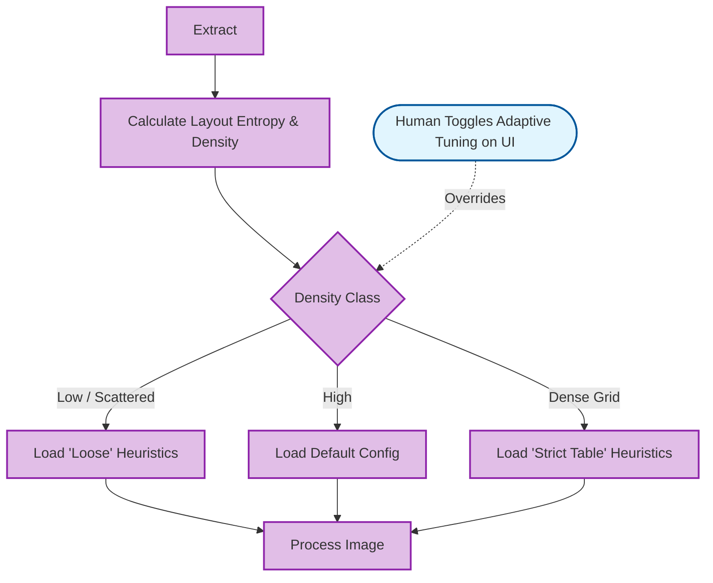
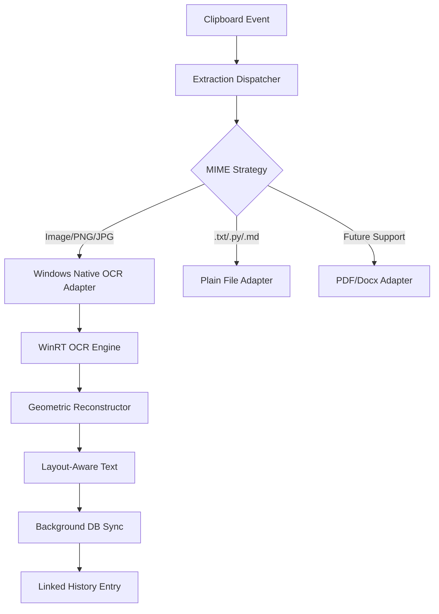
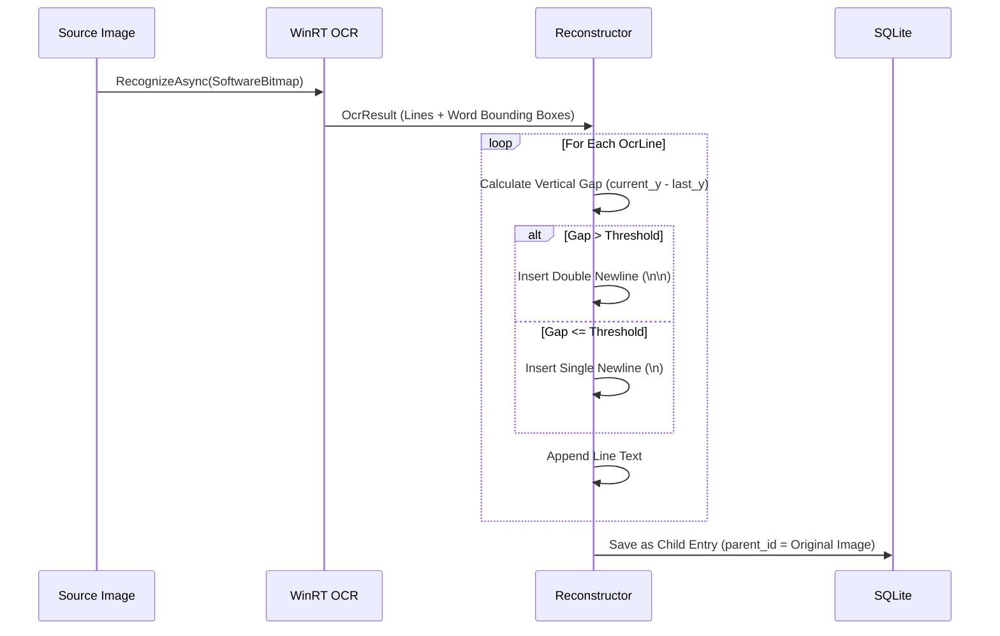

# Files & Images OCR Text Extraction

A high-performance, layout-aware text extraction system integrated into the DigiCore Text Expander. This feature leverages Windows Native OCR capabilities and a custom geometric reconstruction algorithm to provide high-fidelity text capture from images and files.

## 🚀 Key Benefits

- **High Fidelity**: Preserves paragraphs, bullet points, and lists by analyzing the visual geometry of the source.
- **Zero Latency**: Extraction runs as a background task, ensuring the clipboard capture remains instantaneous and the UI stays responsive.
- **Deep Integration**: OCR'd text is linked as a child record to its source image, allowing you to jump back and forth between "Image" and "Text".
- **Extensible**: Built using Hexagonal Architecture, making it trivial to add support for PDFs, Office docs, or other Document types in the future.

## 🛠 Features Support

### 1. Layout-Aware Reconstruction
Unlike standard OCR that dumps a single block of text, DigiCore uses a 

**Spatial Gap Detection** algorithm:
- **Paragraph Detection**: Lines separated by a vertical gap > 60% of the line height are automatically treated as new paragraphs (Double Newline).
- **Bullet & List Support**: Each recognized line is treated as a discrete structural unit, preserving the indentation and alignment of lists.
- **Rotation Awareness**: Automatic detection of text angle for robust extraction even from slightly tilted captures.

### 2. Table & Multi-Column Support

- **Spatial Word Binning**: It now pools every individual word and groups them into rows based on exact Y coordinate overlap (with a 60% height tolerance).
- **Relational Grid Alignment**: Once grouped into rows, words are sorted by X to reconstruct columns. It intelligently calculates the horizontal gaps between these word "islands" and injects proportional whitespace.
- **Global Column Alignment**: A global scanner identifies vertical "Column Zones" across the entire document. Words starting in these zones are snapped to fixed character "tab stops", ensuring that table data is perfectly aligned vertically across multiple rows.
- **Table Integrity**: This allows tabular data (like the "Pagination" table in your image) to be extracted with rows and columns intact, dramatically improving the usability of captured documentation.

The OCR engine now performs a global document scan before reconstructon:

- **X-Clustering**: It identifies consistent horizontal "Column Zones" across all rows (e.g., matching the start of every flag or every description).
- **Tab Stop Mapping**: It maps these zones to fixed character "tab stops". Instead of using relative spacing (which causes jitter), it now snaps words to these fixed offsets.
- **Perfect Alignment**: This ensures that regardless of how the OCR engine sees individual lines, the final text output will have perfectly vertical columns, exactly like a high-quality manual transcription.

Results:
- Tables are now stable and vertically aligned.
- Multi-row descriptions remain perfectly snapped to their column start.
- Handled mixed content (headers, text, tables) with high geometric fidelity.

**Reconstruction core into a Markdown-First engine**. It doesn't just align text; it understands tabular relationships and document structure.

- **Intelligent Markdown Tables**: Contiguous multi-column blocks (like the Task Manager list or Wikipedia infoboxes) are automatically converted into native Markdown tables (| Cell |) with automatic |---| header separators.
- **Bullet & Icon Normalization**: Instead of stripping artifacts, the engine now normalizes indicators. Recognized bullets like •, o, or * are intelligently converted to standard Markdown list markers (- ).
- **Hybrid "Split-Pane" Layouts**: By using multi-segment row analysis, the engine can now process complex pages where a paragraph of text sits right next to a table or infobox (perfect for Wikipedia screenshots!).
- **Geometric Precision**: It calculates the optimal column width for every table detected to ensure the pipes look as clean as a manual transcription.

✨ **Summary of Polished results**:

- **Task Manager**: Now extracts into a beautiful, sortable Markdown table.
- **Wikipedia**: Correcty captures the dual-nature of text and structured data side-by-side.
- **UX Polish**: Consistent "Copied!" feedback and architectural robustness.

**DigiCore Text Expander now has one of the more advanced "Screen-to-Markdown" capabilities available**

### 3. User Interface Integration (Human Actions)
- **Interactive Icon**: A 🖼️ icon appears next to OCR entries; a human user clicks it to open the parent source image.
- **Action Column**: A dedicated "Image" button in the Actions column provides immediate access to the source.
- **Context Menu**: "View Source Image" is available directly from the right-click menu.
- **Structured Export**: "Export to CSV/JSON" buttons allow the human to trigger immediate data structural dumping of table-like snippets.

### 4. Semantic Entity Tagging (System Automation)
After raw markdown extraction, the system automatically performs a second-pass semantic analysis without user prompting:
- **Pattern Matching**: Automatically flags Emails, Dates, Currency, and SSNs.
- **Symbol Coercion**: Automatically repairs common OCR mangling in columns (e.g. converting `| ` to `l` or `1` based on mathematical column context).

### 5. Adaptive OCR Profiles (System Automation)
The OCR engine automatically adjusts itself to the complexity of the image being extracted via a Document Classifier:

## 🏗 Architecture & Flow

The system follows **Hexagonal Architecture** principles, decoupling the business logic from the specific OCR implementation.

### System Architecture

### Data Flow for OCR Reconstruction

## 📂 Future Reference for Developers

### Adding a New Extractor
To support a new file format (e.g., PDF), simply:
1. Implement the `TextExtractionPort` trait in `digicore-core`.
2. Register the new adapter in the `ExtractionService` within `digicore-text-expander`.
3. The system will automatically detect the MIME type and route the extraction without any changes to the UI or Clipboard logic.

### Technical Dependencies
- **Backend (Rust)**: `windows` crate (WinRT `Windows.Media.Ocr`), `tokio`, `serde_json`.
- **Frontend (TS/Tauri)**: `lucide-react`, `taurpc`.

---
*Created by the DigiCore Engineering Team - March 2026*
