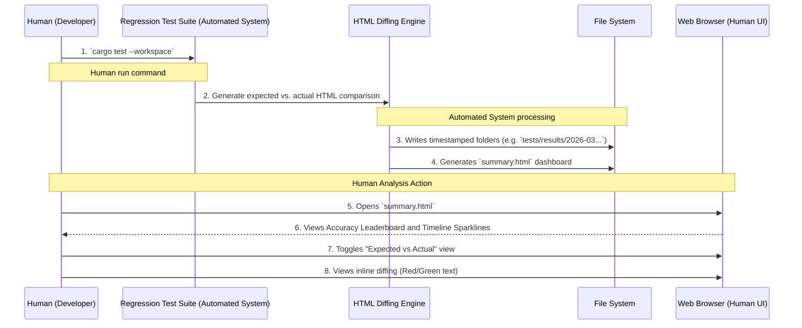
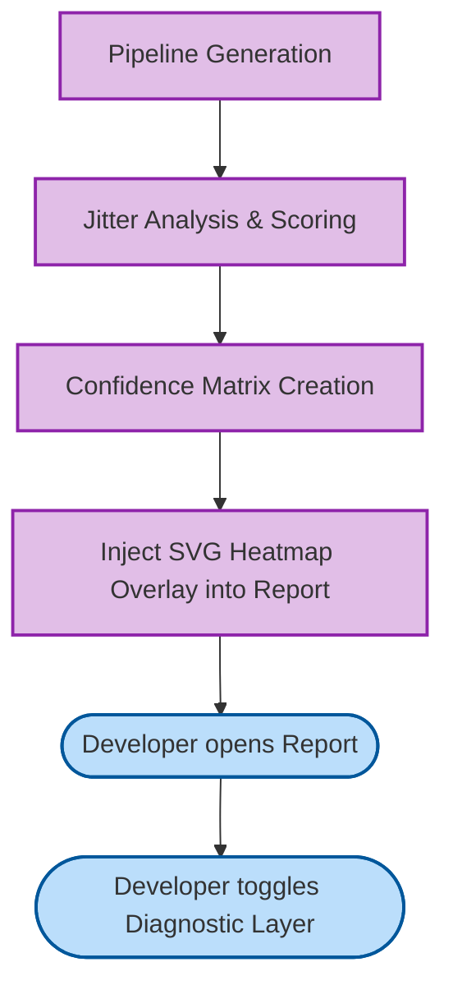

# Analytics and Diagnostics Reports (Phases 34-47)

The OCR Analytics and Diagnostics system automates the generation of rich HTML reports, visual heatmaps, and mult-run timeline analytics. These tools aid humans in interpreting internal system heuristics and building confidence in extracted layouts.

## Generating and Viewing Interactive Reports

**Goal:** Understand how the OCR engine interprets dense tables and complex layouts by viewing an interactive `summary.html` report.

### Human vs. System Control
- **System Action:** During `cargo test`, the regression suite silently iterates over every sample image (`.png`) and baseline (`.snap`). It runs string similarity algorithms (Levenshtein) and compiles an interactive wall-of-fame directory containing detailed HTML logs for each image, plus a high-level `summary.html` index.
- **Human Action:** The developer uses a standard Web Browser to open the `summary.html` file. They use mouse clicks to expand failing test cases, scroll side-by-side synchronized views, and toggle between Expected markdown and the Actual Engine generated markdown.

## Diagnostic Modes: Structural Confidence & Heatmaps

### Deciphering the Heatmap
When the developer toggles the **Diagnostic Heatmap** in an HTML report, they'll see:
*   **Green:** Perfect row/column consensus.
*   **Amber:** Mild jitter (word is slightly off-center from the recognized column). The system used a wide Gap Gate to reconstruct this.
*   **Red:** Low Structural Confidence. The word "floated" across multiple layout heuristics without matching a contiguous block. 

*Human Action Required:* Red highlights indicate the layout was too complex for the current heuristics. The developer should modify the system Configuration parameters via the Tauri UI and regenerate the Corpus snapshot.

## Multi-Run Timeline Tracking

To prevent regression degradation over multiple development cycles, the system tracks specific metrics over time.

### System Automated Telemetry Storage
1. At the conclusion of `cargo test`, the system aggregates the total Time (ms), total Entropy (Layout Complexity), and total Accuracy (%) across all samples.
2. The system appends this record to `history.json`.

### Human Dashboard Pulse
1. When generating `summary.html`, the system reads `history.json`.
2. It generates sleek, animated SVG sparklines representing "Performance Pulses".
3. The Human developer views these pulses in the browser to identify if recent commits caused a latency spike or broad accuracy drop across the entire regression suite.
