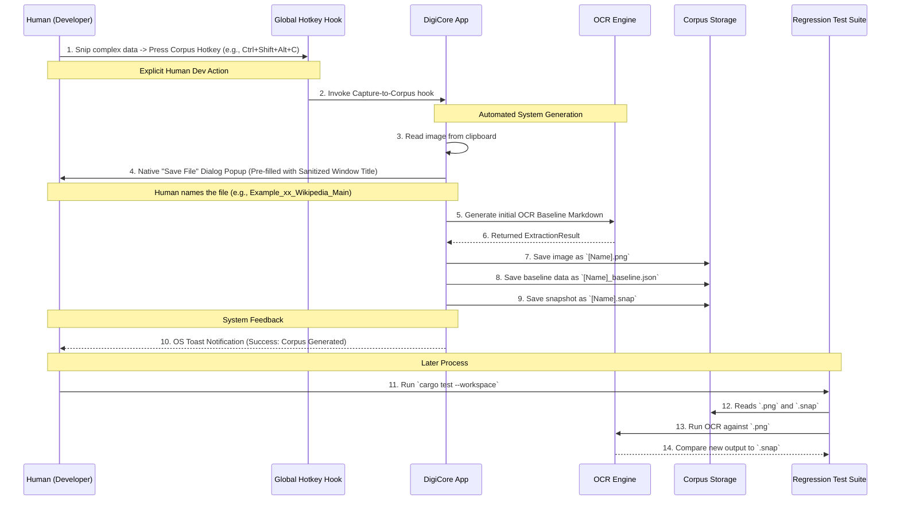

# 📸 One-Click Corpus Generation Tool (Phases 30-55)

The Corpus Generation tool is a specialized suite built into the DigiCore Text Expander designed to rapidly accelerate the development and tuning of our OCR Extraction Engine. It allows developers (Humans) to quickly capture complex screen layouts and automatically (System) generate the necessary baseline testing files (`.png`, `.json`, `.snap`) required for automated regression testing.

## Why Corpus Generation?
Before this tool, adding a new test case involved taking a screenshot, manually copying the image to a test folder, writing a Rust test function, tweaking heuristics, and manually compiling the expected Markdown output block.

Now, you press a single hotkey, and the system handles the rest.

## Workflow: Human vs. System



## How to Use the Corpus Generator

### 1. Enable Corpus Mode (Human)
Ensure you have the latest Tauri Application running. 
1. Navigate to the **Configurations and Settings** tab.
2. Select **Corpus Generation** and toggle the feature ON.
3. Configure your desired **Output Directory** (defaults to `docs/sample-ocr-images`).

### 2. Capture a Complex Layout (Human)
Use the standard OS Snipping Tool (e.g., Win+Shift+S) to capture a confusing paragraph, a densely packed table, or a form with irregular alignment. The image is now on your clipboard.

### 3. Generate Snapshot (Human -> System)
While the Tauri App is running in the background, press the designated Corpus Generation Shortcut (e.g., `Ctrl+Shift+Alt+C`).

The **System** will immediately:
1. Intercept the hook.
2. Extract the image from the clipboard.
3. Extract the active Window Title and sanitize it (replacing spaces/special characters with `_`).
4. **Pop open a native "Save File" dialog** pre-filled with the name format `Example_xx_[Sanitized_Title].png`.
5. Once the Human clicks **Save**, the system will run the complete OCR Pipeline, including Layout Reconstruction and Grid Alignment using the current configured heuristics.
6. Save three files to your configured Corpus Output Directory using the chosen name:
    - `[Name].png`: The raw image.
    - `[Name]_baseline.json`: Metadata about the extraction (processing time, selected heuristic profile).
    - `ocr_regression_tests__[Name].snap`: The Insta crate golden master snapshot containing the expected Markdown output.

You will receive an OS Toast Notification upon successful generation.

## Regression Analytics (System)
Once you have generated multiple Corpus entries, you can run the OCR regression test suite.

The system will loop over all `.png` files in the Corpus, run the extraction, and instantly compare the Markdown against the `.snap` file.

### Interactive HTML Reports
To help diagnose failures, the system automatically generates an interactive `summary.html` report.

```mermaid
flowchart LR
    classDef humanView fill:#e1f5fe,stroke:#01579b,stroke-width:2px;
    classDef systemAuto fill:#f3e5f5,stroke:#4a148c,stroke-width:2px;

    RunTest([cargo test]):::humanView --> Exec[ocr_regression_tests.rs]:::systemAuto
    Exec --> Diff[Diffing Engine (strsim)]:::systemAuto
    Diff --> HTML[Generate HTML Reports]:::systemAuto
    
    HTML --> Dashboard[summary.html Dashboard]:::systemAuto
    HTML --> SVG[Diagnostic SVG Heatmaps]:::systemAuto
    
    Dashboard --> HumanReview([Developer Reviews Failures]):::humanView
```

Developers (Humans) can open the `summary.html` report to view:
*   Side-by-side expected vs actual outputs.
*   Red/Green text highlighting of exact character additions or deletions.
*   An overlay SVG Heatmap displaying **Structural Confidence Scores** (amber/red jitter highlighting for misaligned words).
