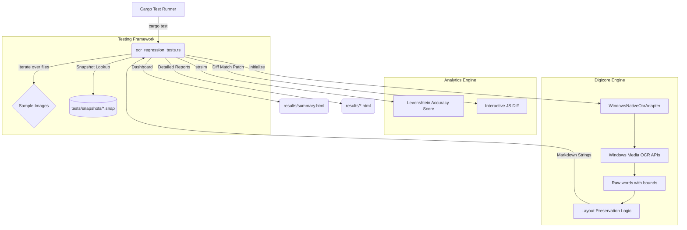

# OCR Text Extraction Engine: Automated Regression Testing Guide

## Purpose and Intent

The core objective of the OCR engine in DigiCore Text Expander is to transcend raw text recognition and bridge the gap into high-fidelity layout preservation. To achieve this, our engine relies on highly specific mathematical heuristics—density rules, margin tolerances, character-width clusters, and split thresholds—to accurately extract multi-column paragraphs, complex grids, and dense plain-text lines without losing formatting.

Because OCR layout analysis relies heavily on carefully balanced heuristics, any adjustment to fix a bug in ONE type of document layout carries a severe risk of degrading (regressing) the performance on ANOTHER type of layout.

**The Automated OCR Regression Test Suite** was created precisely to mitigate this risk. By running a single command, you dynamically process a curated library of diverse layout examples, outputting the results as raw Markdown. This establishes a tight, continuous integration loop for testing heuristic tweaks across the entire spectrum of OCR use cases.

---

### Updating Baselines (Accepting Changes)
If you intentionally improved the OCR logic and want to lock in the new (better) output as the new "Golden Master," use the `cargo-insta` CLI with a filter to avoid running unrelated unit tests:
```powershell
# This command runs ONLY the OCR tests and interactively lets you review/accept
cargo insta test --test ocr_regression_tests --review
```

---

## Testing Architecture

The regression suite relies on a native Rust integration test leveraging the `WindowsNativeOcrAdapter`. This ensures the test accurately represents the final pipeline that a user experiences when triggering the clip-expand feature.



The system automatically performs these advanced tasks:
1. **Discovers Assets**: Sweeps the `docs/sample-ocr-images/` directory.
2. **Snapshot Comparison**: Retrieves the "Golden Master" for each image and calculates a **% Match Accuracy Score**.
3. **Visual Dashboarding**: Generates the **"Wall of Fame"** (`summary.html`), a color-coded grid showing the health of the entire engine.
4. **Interactive JS Diffing**: Produces a detailed report for every image with a **character-level visual diff** (Red/Green) computed in-browser.

---

## How to Run The Regression Tests

Running the regression suite is built seamlessly into the Rust cargo paradigm.

**Step 1:** Open an administrative PowerShell prompt (or any standard terminal) and ensure you are in the core crate root:
```powershell
cd C:\Users\pinea\Scripts\AHK_AutoHotKey\digicore\crates\digicore-text-expander
```

**Step 2:** Execute the specific integration test with output capturing disabled. 
> [!NOTE]
> The suite is now configured to **never stop on failure**. It will process every image in your sample folder and generate a full report, even if snapshots mismatch.

```powershell
# Run all tests and generate the Summary Dashboard
# Use -- --nocapture to see the "processing: ExampleX" logs in real-time
cargo test --test ocr_regression_tests -- --nocapture
```

**Step 3:** Review any differences interactively. If the console reports "FOUND SAMPLES WITH MISMATCHES," you should use `insta` to review and potentially accept the new output as the "Golden Master."

```powershell
# Interactively review all failing snapshots in one go
cargo insta review
```

### Alternative: Direct Review Run
If you know you want to review specific changes immediately without checking the HTML dashboard first, you can combine these:
```powershell
cargo insta test --test ocr_regression_tests --review
```

---

## Evaluation and Workflow

The test will sequentially spin through all defined images. A successful exit code `0` (`ok`) confirms the run completed without fatal engine panics, even if accuracy was not 100%.

```powershell
# Expected console output:
running 1 test
=========== processing: Example1_... ===========
Accuracy: 100%
======================================
...
⚠️  FOUND 3 SAMPLES WITH MISMATCHES/LOW ACCURACY.
Run `cargo insta review` to inspect and accept changes.

Successfully processed 20 images. Dashboard: "docs/sample-ocr-images/results_[TIMESTAMP]/summary.html"
test run_ocr_on_all_samples ... ok
```

---

## Evaluating the Results

It's critical for QA Analysts and Developers to understand that the test suite does *not* automatically assert that the extraction was "correct." Validating extraction requires human judgment, specifically examining the generated Markdown logic against the visual density of the original test images.

### Key Example Layouts to Validate:
- **Example 1 (`Example1_Column-Data`):** Check for right-aligned numbers (e.g., `Memory (act...`). A correctly tuned engine will retain these as distinct columns without accidentally merging them into adjacent dense paragraphs.
- **Example 2 (`Example2_Mostly-Plain-Text`):** Check for paragraph preservation. High-density heuristic gates should prevent normal multi-line text from "shattering" into markdown table blocks due to minor vertical whitespace.
- **Example 3 (`Example3_Simple-Table`):** Classic rigid table. Ensure headers and multiple narrow columns parse cleanly.
- **Example 10 (`Example10_Plain-Text`):** A brutal test for hyper-sensitive transition thresholds. Plain text should remain strictly plain text.

### The Feedback Tuning Loop (Next Level)
If a test run reveals a regression:
1. **Open the Dashboard**: Open `summary.html` in the latest results folder.
2. **Analyze the Wall**: Find the red/yellow "Health" badges.
3. **Inspect the Diff**: Click "Details" to see the character-level interactive diff. Red shows what the engine lost (deletions), Green shows what it hallucinated or changed (additions).
4. **Tune Heuristics**: Open `src/adapters/extraction/windows_ocr.rs` and adjust the math blocks (e.g., `cluster_threshold`, adaptive gap multipliers).
5. **Verify**: Re-run `cargo test --test ocr_regression_tests -- --nocapture` and confirm accuracy goes back to 100%.

Always remember: When tuning the OCR logic, **precision is paramount.** A slight adjustment to assist a dense grid may dramatically impact standard paragraph interpretation!
