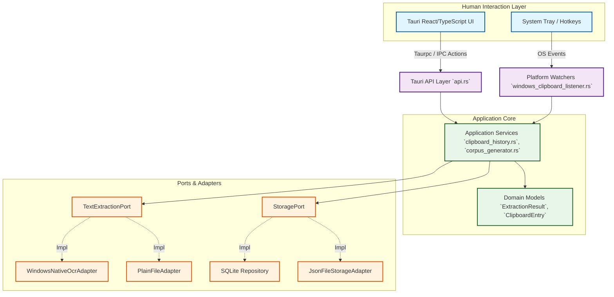
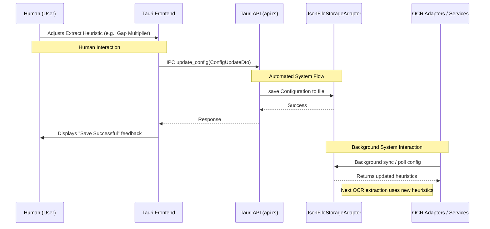

# Text Expander Architecture (Phases 12-55)

The DigiCore Text Expander uses a Hexagonal Architecture (Ports and Adapters) to ensure business logic is decoupled from UI, storage, and platform-specific implementations. This architectural choice has been pivotal in adding extensible features like Advanced OCR, Automated Corpus Generation, and Adaptive Configuration over the course of Phases 12 through 55.

## High-Level System Architecture

The following diagram illustrates the relationship between the Tauri Frontend (Human Interaction layer), the Core Domain Logic, and the various external Adapters via defined Ports.

### Explanation of Layers

1. **Human Interaction Layer (Blue):** This is where the user directly interacts with the application, either through the rich React/TypeScript configuration UI or by triggering OS-level hotkeys and clipboard events.
2. **System Entry Points (Purple):** The boundaries that receive input from the human layer (IPC calls from Tauri, or OS hooks for clipboard changes) and normalize them for the application core.
3. **Application Core (Green):** Contains the business rules, such as extraction dispatching (`ExtractionDispatcher`), adaptive OCR tuning, and clipboard deduplication.
4. **Ports & Adapters (Orange):** The infrastructure layer. The Core defines *what* it needs via Ports (e.g., `TextExtractionPort`), and the Adapters know *how* to do it (e.g., `WindowsNativeOcrAdapter` calling WinRT APIs).

## The OCR Processing Pipeline

The text extraction engine is a highly refined pipeline that converts raw images into structured Markdown, CSV, or raw text. This process is fully **automated (system-driven)** once triggered by a human action (like copying an image or dropping a file).

### Key automated features inside the OCR pipeline:
*   **Spatial Margin Analysis:** Dynamically reconstructs paragraphs and indentations by analyzing vertical gaps.
*   **Table Detection:** Automatically detects column boundaries using X-coordinate clustering to generate valid Markdown tables.
*   **Adaptive Heuristics:** The system identifies the entropy/complexity of an image and dynamically loads specific heuristic profiles via the `HeuristicConfig` without requiring human intervention.

## Configuration Data Flow (GUI-First)

In Phase 55, the architecture shifted to a GUI-First Configuration model. This means that human settings drive system behaviors directly through unified storage, eliminating disconnected external config files.

### Human vs. System Control
*   **Human Control:** The user utilizes the Tauri Frontend (`ConfigTab.tsx`) to set bounds, choose OCR sensitivity, toggle adaptive tuning, and select target directories for output.
*   **System Action:** `JsonFileStorageAdapter` persists these selections. Internal adapters (`WindowsNativeOcrAdapter`, `CorpusGenerator`) are injected with (or pull) these configurations at runtime to automatically shape their behavior during background processing.
