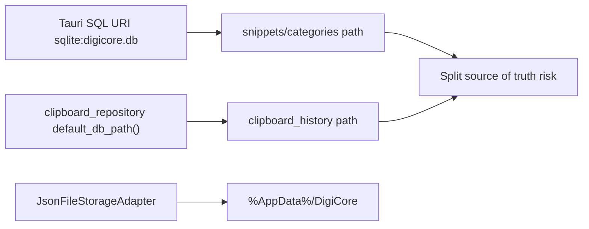

# Database Path Unification Audit and Decision Memo

## Key Objective

- Protect critical existing text-expander data (`snippets`, `categories`, and related runtime content) while moving to a **single long-term source-of-truth database path** for both text expansion and clipboard history.
- Eliminate path ambiguity between:
  - `%AppData%\\com.digicore.text-expander\\digicore.db`
  - `%AppData%\\DigiCore\\digicore.db`

## Current-State Findings

### 1) Database path split exists today

- Text-expander SQL usage (frontend + migrations) points to `sqlite:digicore.db` via Tauri SQL plugin and frontend SQL adapters:
  - [C:/Users/pinea/Scripts/AHK_AutoHotKey/digicore/tauri-app/src-tauri/src/lib.rs](C:/Users/pinea/Scripts/AHK_AutoHotKey/digicore/tauri-app/src-tauri/src/lib.rs)
  - [C:/Users/pinea/Scripts/AHK_AutoHotKey/digicore/tauri-app/src-tauri/tauri.conf.json](C:/Users/pinea/Scripts/AHK_AutoHotKey/digicore/tauri-app/src-tauri/tauri.conf.json)
  - [C:/Users/pinea/Scripts/AHK_AutoHotKey/digicore/tauri-app/src/lib/sqliteLoad.ts](C:/Users/pinea/Scripts/AHK_AutoHotKey/digicore/tauri-app/src/lib/sqliteLoad.ts)
  - [C:/Users/pinea/Scripts/AHK_AutoHotKey/digicore/tauri-app/src/lib/sqliteSync.ts](C:/Users/pinea/Scripts/AHK_AutoHotKey/digicore/tauri-app/src/lib/sqliteSync.ts)
- Clipboard history repo uses explicit filesystem path resolver under `DigiCore`:
  - [C:/Users/pinea/Scripts/AHK_AutoHotKey/digicore/tauri-app/src-tauri/src/clipboard_repository.rs](C:/Users/pinea/Scripts/AHK_AutoHotKey/digicore/tauri-app/src-tauri/src/clipboard_repository.rs)

### 2) Storage base roots are mixed

- `JsonFileStorageAdapter` and many JSON/config/script assets use `%AppData%\\DigiCore`:
  - [C:/Users/pinea/Scripts/AHK_AutoHotKey/digicore/crates/digicore-text-expander/src/adapters/storage/json_file_storage.rs](C:/Users/pinea/Scripts/AHK_AutoHotKey/digicore/crates/digicore-text-expander/src/adapters/storage/json_file_storage.rs)
- SQL for text-expander is effectively associated with Tauri plugin app namespace (`com.digicore.text-expander`) in your environment.

### 3) Data-risk conclusion

- There is real risk of partial writes/reads against different DB files depending on feature path.
- Most critical production data (snippets/categories) currently sits in `%AppData%\\com.digicore.text-expander\\digicore.db`; this should be treated as highest-priority source during migration.

## Architecture Snapshot

## Alternative Long-Term Options

### Option A (Recommended): Standardize on `%AppData%\\com.digicore.text-expander\\digicore.db`

- **Description**: Move/merge clipboard history into the same DB currently holding critical snippets/categories; update clipboard repository to resolve to this DB path.
- **Pros**:
  - Preserves your highest-value data location as-is.
  - Lowest risk of losing snippet/category data.
  - Clear single DB source for all SQL-backed tables.
- **Cons**:
  - Requires clipboard path refactor + one-time migration from `%AppData%\\DigiCore\\digicore.db`.
  - Must handle existing clipboard-image/json directory references carefully.
- **SWOT**:
  - **Strength**: Maximum safety for existing core data.
  - **Weakness**: Transitional migration complexity.
  - **Opportunity**: Cleanly define canonical DB resolver API used everywhere.
  - **Threat**: If merge order is wrong, clipboard rows could be duplicated/lost.

### Option B: Standardize on `%AppData%\\DigiCore\\digicore.db`

- **Description**: Move/merge snippets/categories into `DigiCore` DB and repoint Tauri SQL consumers.
- **Pros**:
  - Aligns DB with existing JSON/config/scripts/clipboard folders.
  - Potentially simpler folder story (single base root).
- **Cons**:
  - Higher risk because critical snippet/category data must be moved from current app namespace DB.
  - More invasive for SQL plugin path assumptions and existing user installs.
- **SWOT**:
  - **Strength**: Unified root directory concept.
  - **Weakness**: High-risk migration for critical data.
  - **Opportunity**: Future packaging consistency.
  - **Threat**: Any migration bug impacts core text expansion functionality first.

### Option C: Introduce configurable DB root with resolver + staged cutover

- **Description**: Add explicit `db_root` config and runtime resolver; run migration assistant then lock to one root.
- **Pros**:
  - Most flexible; allows controlled transitions and rollback.
  - Good for enterprise deployments and custom data folders.
- **Cons**:
  - Higher implementation complexity and testing surface.
  - More moving parts than needed for immediate fix.
- **SWOT**:
  - **Strength**: Robust long-term architecture.
  - **Weakness**: Overhead for current urgent issue.
  - **Opportunity**: Supports portable/team-managed deployments.
  - **Threat**: Misconfiguration can perpetuate split if not locked post-migration.

## Recommendation (with rationale)

- **Recommend Option A now**: keep `%AppData%\\com.digicore.text-expander\\digicore.db` as canonical DB path.
- **Rationale**:
  - Your critical trigger/category content already lives there.
  - Minimizes risk by migrating lower-priority clipboard data toward critical-data location (not vice versa).
  - Fastest path to stable single-source-of-truth with minimal user disruption.

## Proposed Safe Migration Plan (No Data Loss Focus)

1. Introduce shared DB path resolver used by:
  - Tauri SQL plugin consumers
  - clipboard repository (`rusqlite` path)
2. On startup (one-time migration gate):
  - Detect both DB files.
  - Backup both DBs with timestamp before any write.
3. Merge strategy:
  - Keep canonical snippets/categories from canonical DB.
  - Upsert/append clipboard rows from legacy clipboard DB if needed.
  - Rebuild/verify required indexes and schema columns.
4. Repoint clipboard repository to canonical DB.
5. Keep old DB as backup for N days (read-only/no writes), then optional cleanup.
6. Emit explicit migration diagnostics to Log tab (start/success/warn/error + counts).

## Key Decisions Requiring Your Input

- Canonical DB path:
  - `%AppData%\\com.digicore.text-expander\\digicore.db` (recommended)
  - or `%AppData%\\DigiCore\\digicore.db`
- Migration scope:
  - DB-only merge
  - or DB merge + normalize support folders (`config`, `scripts`, `clipboard-images`, `clipboard-json`)
- Conflict policy for duplicate clipboard rows:
  - hash-based dedupe preferred
  - keep-first vs keep-latest when hashes collide
- Backup retention window:
  - e.g., 7 / 14 / 30 days before optional old-path cleanup

## Logging and Supportability Requirements

- Add migration lifecycle events in diagnostics/log:
  - `db.unify.detected_paths`
  - `db.unify.backup.created`
  - `db.unify.merge.completed` (with row/table counts)
  - `db.unify.cutover.completed`
  - `db.unify.error`
- Include both source/target path + record counts in each event for auditability.

## Risks and Mitigations

- **Risk**: accidental overwrite of canonical data.
  - **Mitigation**: preflight backups + read-only verification before cutover.
- **Risk**: schema mismatch between DBs.
  - **Mitigation**: migration prechecks and idempotent ALTER guards.
- **Risk**: clipboard asset pointers stale after DB merge.
  - **Mitigation**: path validation + optional asset path rewrite pass.

## Readiness Checklist (before implementation)

- Confirm canonical DB root.
- Confirm migration scope (DB-only vs full folder normalization).
- Confirm conflict policy for clipboard duplicates.
- Confirm backup retention duration.

## Outcome After Approval

- One canonical DB for snippets/categories/clipboard history.
- Deterministic startup migration with backups.
- Clear long-term path governance for DB and support assets.
- Reduced operational ambiguity and safer future feature work.

