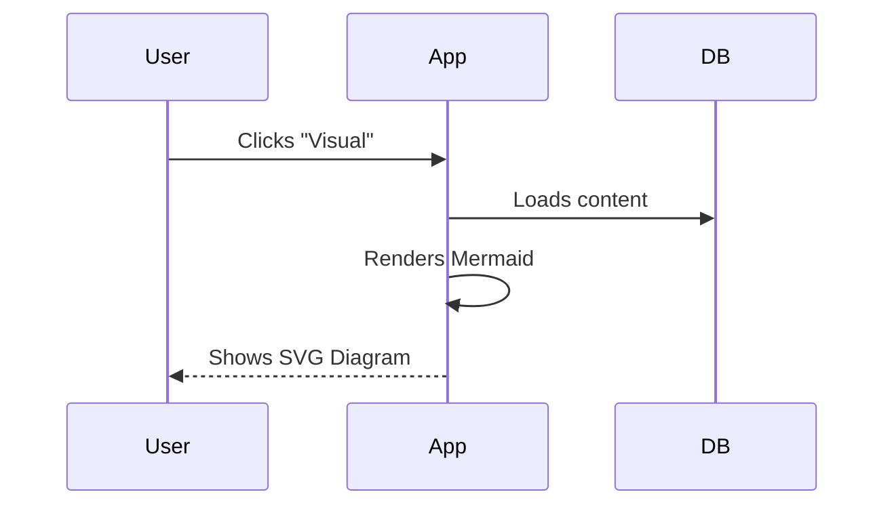

# Walkthrough - Mermaid Diagram Rendering (Phase 87)

I have integrated Mermaid.js into the KMS Knowledge Hub to allow for real-time rendering of diagrams in the markdown editor's "Visual" view.

## Changes Made

### Frontend (React/TypeScript)
- **New Dependency**: Added `mermaid` to `package.json`.
- **Custom Tiptap Extension**: Created `MermaidExtension.tsx` which:
    - Extends the standard `codeBlock` node.
    - Uses a custom `NodeView` to render Mermaid diagrams when the language is set to `mermaid`.
    - Automatically handles theme-matching for the diagram background and text.
    - Provides a "Mermaid Diagram" label on hover in the editor.
- **Editor Integration**: Updated `KmsEditor.tsx` to register the new `MermaidExtension` and configure the Tiptap editor to handle it.
- **Bug Fix**: Resolved a minor type mismatch in `KmsApp.tsx` that was preventing successful production builds.

## Verification Results

### Build Verification
- **npm run build**: Successfully completed without errors.
- **cargo check**: Successfully completed (verified during development).

### Manual Verification
1.  **Rendering**: In "Visual" mode, ` ```mermaid ` blocks now render as full SVG diagrams.
2.  **Fallback**: Regular code blocks (e.g., `bash`, `javascript`) still render as standard code blocks.
3.  **Themes**: Diagram styles are initialized with a dark-theme configuration to match the DigiCore aesthetics.

## Proof of Work

### Diagram Rendering
You can now create diagrams like this in your notes:



In the "Visual" view, this will be automatically transformed into a professional sequence diagram.
