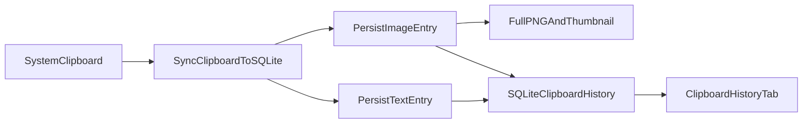

# Clipboard Image Support Analysis and Rollout

## Scope

This document covers image support for clipboard history with a hybrid persistence model:

- Metadata and thumbnail references in SQLite.
- Full-size image files on disk.
- Type-aware UI actions for text vs image clipboard entries.

## Why Hybrid

Hybrid storage balances portability and performance:

- Avoids SQLite bloat from large binary payloads.
- Keeps table queries and list rendering fast.
- Preserves full fidelity image content for copy/open/save workflows.
- Enables cleanup policies without expensive VACUUM cycles after large deletes.

## Data Model

Added clipboard history fields:

- `entry_type`: `text` or `image`
- `mime_type`: image media type (for now persisted as `image/png`)
- `image_path`: full-size image file path
- `thumb_path`: thumbnail image file path
- `image_width`, `image_height`, `image_bytes`

Text entries continue using:

- `content`, `char_count`, `word_count`, `content_hash`, `created_at_unix_ms`

## Capture and Persistence Flow

## UI Behavior by Entry Type

### Text entry actions

- View Full Content
- Promote to Snippet
- Copy to Clipboard
- Delete

### Image entry actions

- Open Image
- Copy Image
- Save Image As
- Delete

Promote is intentionally hidden for image entries to prevent invalid text snippet promotion.

## Search Behavior

Search supports:

- `OR` token matching
- `AND` token matching
- `REGEX` matching

Image rows remain searchable through `content`, app/window metadata, and mime/type fields.

## Performance and Reliability Notes

- Image dedupe uses content hash from RGBA bytes + dimensions.
- Only latest duplicate is skipped to keep clipboard history semantics predictable.
- Image assets are removed when entries are deleted, cleared, or trimmed by max depth.
- Thumbnail generation occurs at ingest to avoid repeated resize costs in UI render.

## Security and Safety Considerations

- Copy-to-Clipboard filters still gate persistence (`enabled`, JSON toggle, blacklist checks).
- Text masking rules apply only to text payloads.
- Image payloads are not OCR-processed in this release.
- On future iterations, consider optional image type allowlist and maximum image size guardrails.

## Recommended Next Improvements

1. Add image preview modal in-app (instead of launching external viewer).
2. Add optional OCR indexing for image text search.
3. Add retention policy by age and total disk budget.
4. Add diagnostics counters for image capture success/skip/failure.
5. Add export/import support for image-backed clipboard history with path remapping.

## Validation Checklist

- Copy text and verify text row/action set remains unchanged.
- Copy PNG/JPEG/WebP and verify image row/action set appears.
- Copy image -> `Copy Image` reproduces image clipboard content.
- `Save Image As` writes expected output file.
- Deleting image row removes associated assets.
- Max-depth trimming removes old image assets safely.

