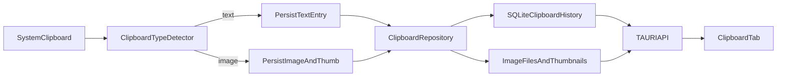

# Clipboard History Priority Plan

## Objectives (in requested order)
- Resolve `Max History Entries` saving at 5000 but reverting to 100.
- Add `Created Date/Timestamp (UTC)` to `Clipboard History` table display.
- Add clipboard image support (hybrid storage) with type-aware actions/context menus.
- Produce a standalone markdown analysis/design doc for image support.

## 1) Fix Max History Persistence (5000 -> 100 regression)

### Root cause identified
- Startup loading still clamps clipboard depth to `100` in [`C:/Users/pinea/Scripts/AHK_AutoHotKey/digicore/tauri-app/src-tauri/src/lib.rs`](C:/Users/pinea/Scripts/AHK_AutoHotKey/digicore/tauri-app/src-tauri/src/lib.rs) (`clip_history_max_depth` load path).
- Runtime config update path clamps to `100` in [`C:/Users/pinea/Scripts/AHK_AutoHotKey/digicore/tauri-app/src-tauri/src/api.rs`](C:/Users/pinea/Scripts/AHK_AutoHotKey/digicore/tauri-app/src-tauri/src/api.rs) (`update_config` handling for `clip_history_max_depth`).

### Planned changes
- Align all depth clamp paths to `5..5000`:
  - startup load clamp
  - `update_config` clamp
  - any import/export apply paths that indirectly call `update_config`
- Keep `save_copy_to_clipboard_config` as the authority for copy settings and depth synchronization.
- Add regression test coverage for:
  - set `max_history_entries=5000` -> save -> reload state -> remains `5000`.

## 2) Add Created UTC Timestamp Column in Clipboard Table

### Current state
- Backend already returns `created_at` (string unix ms) in `ClipEntryDto`.
- Frontend table in [`C:/Users/pinea/Scripts/AHK_AutoHotKey/digicore/tauri-app/src/components/ClipboardTab.tsx`](C:/Users/pinea/Scripts/AHK_AutoHotKey/digicore/tauri-app/src/components/ClipboardTab.tsx) does not render created timestamp column.

### Planned changes
- Add a new table column `Created (UTC)` in `Clipboard History`.
- Convert `created_at` unix-ms string to formatted UTC display: `YYYY-MM-DD hh:mm:ss A UTC`.
- Keep `Snippet Created` column unchanged and separate (as requested).
- Add fallback handling for invalid/missing timestamp (show `-`).
- Add/adjust frontend test assertions for this column render.

## 3) Clipboard Image Support (Hybrid storage)

### Architecture choice (selected)
- Hybrid model:
  - thumbnail/metadata in SQLite for fast table rendering/search
  - full image files on disk for durability and DB-size control

### Schema/data model plan
- Extend `clipboard_history` schema in [`C:/Users/pinea/Scripts/AHK_AutoHotKey/digicore/tauri-app/src-tauri/src/lib.rs`](C:/Users/pinea/Scripts/AHK_AutoHotKey/digicore/tauri-app/src-tauri/src/lib.rs) migration path with additive columns:
  - `entry_type` (`text` | `image`)
  - `mime_type` (e.g., `image/png`, `image/jpeg`, `image/webp`)
  - `image_path` (full-size image path)
  - `thumb_path` (thumbnail path)
  - `image_width`, `image_height`, `image_bytes`
- Update repository adapter [`C:/Users/pinea/Scripts/AHK_AutoHotKey/digicore/tauri-app/src-tauri/src/clipboard_repository.rs`](C:/Users/pinea/Scripts/AHK_AutoHotKey/digicore/tauri-app/src-tauri/src/clipboard_repository.rs) to support mixed entry CRUD/list/search while preserving text behavior.

### Capture pipeline plan
- Extend clipboard monitor path in [`C:/Users/pinea/Scripts/AHK_AutoHotKey/digicore/crates/digicore-text-expander/src/application/clipboard_history.rs`](C:/Users/pinea/Scripts/AHK_AutoHotKey/digicore/crates/digicore-text-expander/src/application/clipboard_history.rs) and backend persistence bridge in [`C:/Users/pinea/Scripts/AHK_AutoHotKey/digicore/tauri-app/src-tauri/src/api.rs`](C:/Users/pinea/Scripts/AHK_AutoHotKey/digicore/tauri-app/src-tauri/src/api.rs):
  - detect image payloads from clipboard
  - persist original image file + generated thumbnail
  - hash and dedupe image entries (content hash)
  - retain existing masking/filtering behavior for text entries only

### UI/UX plan (type-aware actions)
- Update `Clipboard History` table row renderer in [`C:/Users/pinea/Scripts/AHK_AutoHotKey/digicore/tauri-app/src/components/ClipboardTab.tsx`](C:/Users/pinea/Scripts/AHK_AutoHotKey/digicore/tauri-app/src/components/ClipboardTab.tsx):
  - show thumbnail preview for image entries
  - show text preview for text entries
- Dynamic actions/menu by entry type:
  - Text: `View Full Content`, `Promote`, `Copy`, `Delete`
  - Image: `View Image`, `Copy Image`, `Open File Location`, `Save As`, `Delete`
  - Hide/disable non-applicable actions (e.g., `Promote` for images).
- Add corresponding backend commands for image-specific actions as needed.

## 4) Standalone Markdown for Images (analysis + recommendations)
- Create new document under docs, e.g.:
  - [`C:/Users/pinea/Scripts/AHK_AutoHotKey/digicore/docs/digicore-text-expander/CLIPBOARD_IMAGE_SUPPORT_ANALYSIS_AND_ROLLOUT.md`](C:/Users/pinea/Scripts/AHK_AutoHotKey/digicore/docs/digicore-text-expander/CLIPBOARD_IMAGE_SUPPORT_ANALYSIS_AND_ROLLOUT.md)
- Include:
  - hybrid rationale
  - schema plan and migration safety notes
  - action/menu matrix by content type
  - performance/storage considerations
  - phased rollout + rollback plan
  - testing matrix

## 5) Validation and Regression Safety
- Frontend tests:
  - `ConfigTab` depth persistence path
  - `ClipboardTab` timestamp rendering
  - type-aware action visibility for text vs image rows
- Backend tests:
  - depth clamp 5000 acceptance
  - image metadata persistence and list hydration
  - mixed search behavior with text/image entries
- Build checks:
  - targeted `vitest` slices
  - backend test compile (`cargo test --no-run`)

## Execution sequence
1. Depth clamp fix and regression tests.
2. UTC created timestamp column and tests.
3. Image schema + repository + DTO extensions.
4. Clipboard capture image ingestion and file/thumbnail persistence.
5. Image-aware UI actions/context menus.
6. Standalone image-support markdown document.
7. Final targeted test pass and regression cleanup.

## Data flow (target state)

