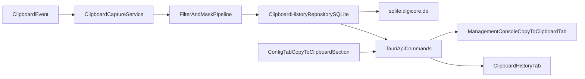
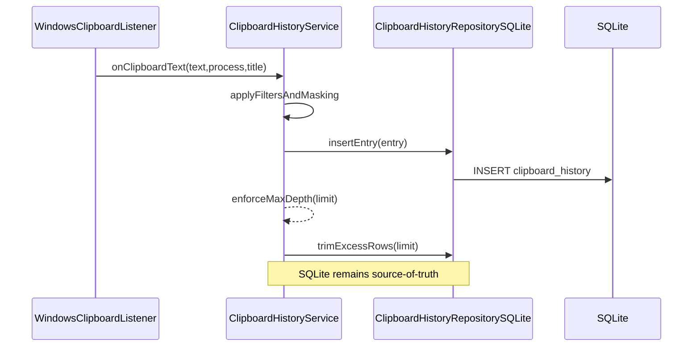

# Copy-to-Clipboard SQLite Migration Plan

## Confirmed Scope Decisions

- Persistence model: **SQLite source of truth**.
- Phase 1 scope: **MVP-focused** (capture controls, filters, masking, list/search/view, JSON-only output, Config-tab subsection, no full hotkey/tray parity yet).

## Audit Findings (Current State)

- Clipboard history is currently **in-memory** only via `CLIP_STATE` in [digicore/crates/digicore-text-expander/src/application/clipboard_history.rs](digicore/crates/digicore-text-expander/src/application/clipboard_history.rs).
- Existing UI tab [digicore/tauri-app/src/components/ClipboardTab.tsx](digicore/tauri-app/src/components/ClipboardTab.tsx) calls RPC methods (`get_clipboard_entries`, `delete_clip_entry`, `clear_clipboard_history`) exposed in [digicore/tauri-app/src-tauri/src/api.rs](digicore/tauri-app/src-tauri/src/api.rs).
- SQLite is already enabled (`sqlite:digicore.db`) with migrations declared in [digicore/tauri-app/src-tauri/src/lib.rs](digicore/tauri-app/src-tauri/src/lib.rs), but only `categories` and `snippets` tables exist.
- Current clipboard config persistence only stores max depth in JSON state file via [digicore/crates/digicore-text-expander/src/adapters/storage/json_file_storage.rs](digicore/crates/digicore-text-expander/src/adapters/storage/json_file_storage.rs).
- Legacy AHK flow supports filtering/masking/retention and dual txt+json output; your requested target is **JSON-only** persistence/output for this phase.

## Target Architecture

## Data Model and Migration

- Add migration `version: 2` in [digicore/tauri-app/src-tauri/src/lib.rs](digicore/tauri-app/src-tauri/src/lib.rs) for table `clipboard_history`:
  - `id INTEGER PRIMARY KEY AUTOINCREMENT`
  - `content TEXT NOT NULL`
  - `process_name TEXT NOT NULL DEFAULT ''`
  - `window_title TEXT NOT NULL DEFAULT ''`
  - `char_count INTEGER NOT NULL DEFAULT 0`
  - `word_count INTEGER NOT NULL DEFAULT 0`
  - `content_hash TEXT NOT NULL DEFAULT ''` (for dedup support)
  - `created_at_unix_ms INTEGER NOT NULL`
- Indexes:
  - `idx_clipboard_history_created_at` on `created_at_unix_ms DESC`
  - `idx_clipboard_history_content_hash` on `content_hash`
- Keep existing tables untouched; no destructive migration.

## API and Backend Changes

- Introduce a SQLite-backed repository module (ports/adapters style), e.g.:
  - [digicore/tauri-app/src-tauri/src/clipboard_repository.rs](digicore/tauri-app/src-tauri/src/clipboard_repository.rs) (new)
- Update clipboard service integration path:
  - [digicore/crates/digicore-text-expander/src/application/clipboard_history.rs](digicore/crates/digicore-text-expander/src/application/clipboard_history.rs)
  - [digicore/tauri-app/src-tauri/src/api.rs](digicore/tauri-app/src-tauri/src/api.rs)
- Replace in-memory source with repository reads/writes for:
  - list entries (ordered newest-first)
  - delete by id (add id-based API), keep index-based compatibility wrapper temporarily
  - clear history
  - max-depth trimming post-insert
- Add/extend config DTO + commands for new settings (Config-tab subsection):
  - `enabled`
  - `min_log_length`
  - `mask_cc`, `mask_ssn`, `mask_email`
  - `blacklist_processes` (phase 1), optional whitelist deferred
  - `max_history_entries`
  - `json_output_enabled` (default true; txt removed)

## Frontend Changes

- New Management Console tab component:
  - [digicore/tauri-app/src/components/CopyToClipboardTab.tsx](digicore/tauri-app/src/components/CopyToClipboardTab.tsx) (new)
  - Features: pause/resume, quick stats, search/filter, list with preview + full view modal, manual refresh, clear/delete actions.
- Keep and refactor existing history tab [digicore/tauri-app/src/components/ClipboardTab.tsx](digicore/tauri-app/src/components/ClipboardTab.tsx) to consume id-based entries from SQLite-backed API.
- Add Config/Settings subsection in existing settings UI (same section where app behavior configs live):
  - include validation and inline guardrails (numeric ranges, boolean toggles, blacklist parser).
- Update generated bindings and frontend types:
  - [digicore/tauri-app/src/bindings.ts](digicore/tauri-app/src/bindings.ts)
  - [digicore/tauri-app/src/types.ts](digicore/tauri-app/src/types.ts)

## JSON Output Policy (No TXT)

- Remove/disable txt-output paths for this feature area.
- Preserve JSON output shape for downstream tooling parity:
  - `timestamp`, `source.process`, `source.title`, `stats.chars`, `stats.words`, `content`.
- Decide implementation approach during build:
  - Preferred: DB is canonical; JSON output generated from persisted rows (stream or scheduled flush) to avoid divergence.

## Diagnostics and Observability

- Add structured diagnostic events (bridge into existing Log tab categories):
  - `clipboard.capture.accepted`
  - `clipboard.capture.skipped_duplicate`
  - `clipboard.capture.skipped_min_length`
  - `clipboard.capture.masked`
  - `clipboard.persistence.write_ok/write_err`
  - `clipboard.maintenance.trim`
- Include level mapping (`INFO`, `WARN`, `ERROR`) with concise metadata.

## Testing Strategy

- Backend/Rust:
  - migration test validates `clipboard_history` table/index presence.
  - repository CRUD tests: insert/list/delete/clear/order/trim.
  - behavior tests: dedup + min-length + masking.
- Frontend/TS:
  - tab rendering and action flows (refresh/search/delete/clear).
  - config subsection validation/disabled-save states.
  - API contract tests for new DTO fields and id-based deletion.
- Regression:
  - ensure existing snippet/category sqlite flows remain unaffected.

## Alternatives (Pros/Cons)

- SQLite source-of-truth (selected):
  - Pros: persistence, queryability, future archive readiness, deterministic deletes.
  - Cons: more repository complexity, migration/testing overhead.
- Hybrid memory-first:
  - Pros: minimal code churn in existing service.
  - Cons: consistency drift risk, restart mismatch, harder debugging.
- File-only JSON source:
  - Pros: simple export compatibility.
  - Cons: weak query/delete performance, weak long-term maintainability.

## SWOT (Selected SQLite Approach)

- Strengths: durable history, scalable querying, enterprise-ready auditability.
- Weaknesses: added schema/version maintenance, potential migration edge cases.
- Opportunities: archival policies, advanced search, analytics dashboards.
- Threats: uncontrolled DB growth without retention jobs; lock/contention in high-frequency copy bursts.

## Key Risks and Mitigations

- DB bloat over time:
  - mitigate with max-depth trimming now and archival strategy hook points.
- High-frequency clipboard events:
  - mitigate with lightweight insert path + batched maintenance trim.
- Legacy index-based delete coupling:
  - mitigate by introducing id-based DTOs and temporary compatibility shim.
- Windows encoding edge cases:
  - enforce UTF-8 normalization and ASCII-safe fallback where needed.

## Open Decisions For Later Phase (Not Blocking MVP)

- Add whitelist support alongside blacklist.
- Add hotkey/tray-equivalent controls.
- Choose real-time JSON writer vs on-demand export from DB snapshots.
- Add archive/purge management UI.

## Delivery Phases

1. Schema + repository + API contract updates.
2. Clipboard service migration to SQLite path with guardrails.
3. New `Copy-to-Clipboard` tab + Config subsection UI.
4. Diagnostics wiring + comprehensive tests.
5. Final audit pass and migration notes document.

