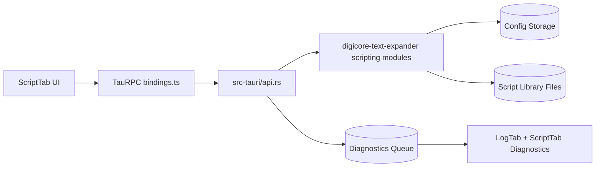
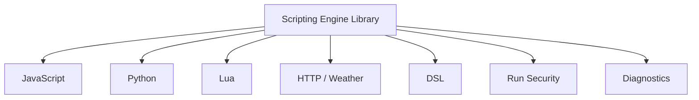
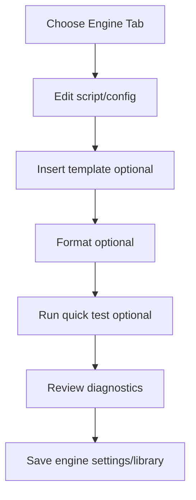
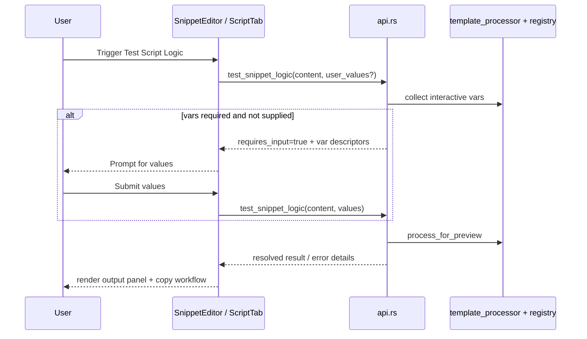
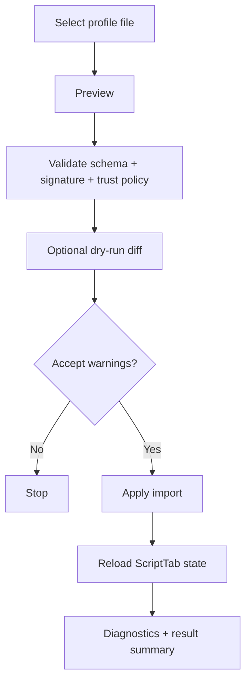

# DigiCore Scripting Library Engine

Technical reference for the Scripting Engine Library in the Tauri app.

This document covers architecture, runtime design, UI capabilities, profile security, trust policy, diagnostics, and recommended operational workflows for engineering teams.

---

## 1) Scope and Goals

The Scripting Library Engine provides:

- Multi-engine authoring and runtime controls for JavaScript, Python, Lua, HTTP/Weather, DSL, and Run.
- In-app script testability with interactive variable support.
- Import/export of scripting profiles for team handoff and environment portability.
- Signed profile integrity validation and signer trust policy controls.
- TOFU (Trust On First Use) with explicit audit logging.
- Diagnostics visibility for script operations and trust events.

Primary objectives:

1. Reliable script execution and preview before production use.
2. Secure profile exchange and tamper detection.
3. Fast onboarding with starter templates and editor ergonomics.
4. Operational traceability for trust decisions and imports.

---

## 2) High-Level Architecture

Key layers:

- **Frontend:** `tauri-app/src/components/ScriptTab.tsx`, `ScriptCodeEditor.tsx`
- **IPC contract:** `tauri-app/src/bindings.ts`
- **Backend API:** `tauri-app/src-tauri/src/api.rs`
- **DTO models:** `tauri-app/src-tauri/src/lib.rs`
- **Runtime engine modules:** `crates/digicore-text-expander/src/application/scripting/*`

---

## 3) Sub-Tab Design and Responsibilities

### JavaScript

- Global JS library editor with line-numbered syntax editor.
- Template insert + quick formatting helper.
- Save and hot-reload global JS library.

### Python

- Global PY library editor.
- Runtime controls: enabled toggle, executable path, library path.
- Template insert + formatting helper.

### Lua

- Global LUA library editor.
- Runtime controls: enabled toggle, executable path, library path.
- Template insert + formatting helper.

### HTTP / Weather

- Runtime controls: timeout, retries, retry delay, async toggle.
- Quick test editor for `{http:...}` and `{weather:...}` placeholders.
- One-click template insert for common placeholders.

### DSL

- DSL enable toggle and save controls.
- Template insert for expression examples.

### Run Security

- Run enable/disable posture through allowlist controls.
- Template insert for common run examples.

### Diagnostics

- Standard scripting status history.
- TOFU audit-focused panel for signer first-trust events.

---

## 4) Script Authoring UX

Features implemented:

- Real code-editor experience (line numbers, syntax language mode, bracket support).
- Per-engine starter packs (JS/PY/LUA/HTTP/DSL/RUN).
- One-click insert and formatting.
- Inline validation and guardrails (paths, numeric ranges, security warnings).
- Save gating for invalid settings.

---

## 5) Test Script Logic Flow

---

## 6) Engine Profile Import/Export

### Supported groups

- `javascript`
- `python`
- `lua`
- `http`
- `dsl`
- `run`

### Modes

- Export all groups or selected groups.
- Import with preview + warning acknowledgement.
- Dry-run diff before apply.
- Signed export with optional detached signature sidecar.

### Diff and apply workflow

---

## 7) Signed Bundles and Integrity Model

Current profile security model:

- Signed schema: `2.0.0`
- Algorithm: `ed25519-sha256-v1`
- Integrity fields include:
  - key id
  - public key
  - payload hash
  - signature
  - signer fingerprint

Validation checks:

1. Schema compatibility (`1.x` legacy migration support, `2.x` signed format).
2. Canonical payload hash verification.
3. Signature verification against embedded public key.
4. Key-id consistency with signer fingerprint derivation.
5. Trust policy enforcement.

---

## 8) Trust Policy and TOFU

Signer registry supports:

- `allow_unknown_signers`
- `trust_on_first_use`
- explicit trusted list
- explicit blocked list

### Policy behavior

- **Blocked signer:** always rejected.
- **Trusted signer:** accepted when signature is valid.
- **Unknown signer + allow unknown:** accepted with warning.
- **Unknown signer + TOFU enabled:** auto-trusted on first verified encounter.
- **Unknown signer + allow unknown disabled + TOFU disabled:** rejected.

### TOFU audit logging

On first trust event, backend emits:

- `[ScriptingSignerTOFU][AUDIT] First trust established signer=<fingerprint> at=<epoch> source=<preview|dry-run|import>`

These entries are highlighted in the Diagnostics TOFU panel.

---

## 9) Detached Signature Export

One-click export can produce:

1. Main signed profile JSON.
2. Detached sidecar signature JSON (`.sig.json`).

Use case:

- External auditors can verify profile payload and signature independent of in-app import flow.

---

## 10) Backend API Surface (Scripting Profiles)

Core operations:

- `export_scripting_profile_to_file`
- `export_scripting_profile_with_detached_signature_to_file`
- `preview_scripting_profile_from_file`
- `dry_run_import_scripting_profile_from_file`
- `import_scripting_profile_from_file`
- `get_scripting_signer_registry`
- `save_scripting_signer_registry`

Related diagnostics:

- `get_diagnostic_logs`
- `clear_diagnostic_logs`

---

## 11) Configuration and Persistence Notes

- Signer registry persisted in app storage as JSON.
- Signing key generated and persisted once (if missing).
- Engine libraries are saved to configured script paths.
- Engine runtime config persists through scripting config subsystem.

---

## 12) Operational Use Cases

### A) Team profile handoff

1. Export selected engine groups.
2. Share signed bundle and detached signature.
3. Receiver previews profile and validates signer trust.
4. Optional dry-run diff.
5. Import with warnings acknowledgement.

### B) Secure onboarding with TOFU

1. Enable TOFU in signer registry policy.
2. Import first verified profile from trusted channel.
3. Confirm TOFU audit event appears.
4. Pin signer in trusted list for explicit long-term policy.

### C) Production hardening

1. Disable `allow_unknown_signers`.
2. Keep TOFU disabled in production if strict trust gating is required.
3. Maintain explicit trusted and blocked signer registries.

---

## 13) Troubleshooting

- **Preview invalid due to signature error**
  - Ensure file was not modified post-export.
  - Verify detached signature and embedded integrity details.
- **Unknown signer blocked**
  - Add signer fingerprint to trusted list or enable TOFU temporarily.
- **Unexpected import changes**
  - Run dry-run diff and review each field entry.
- **No TOFU events shown**
  - Confirm TOFU enabled and signer was unknown at first verified use.
  - Refresh diagnostics panel.

---

## 14) Engineering Best Practices

- Run dry-run before every import in shared environments.
- Keep detached signature files with exported profiles in artifact storage.
- Use trust policy states per environment:
  - dev: unknown allowed or TOFU enabled
  - staging/prod: explicit trusted list preferred
- Review diagnostics after signer/trust operations.

---

## 15) Test Coverage Checklist

- ScriptTab:
  - sub-tab rendering
  - save/update paths
  - template insertion
  - profile preview/import/dry-run
  - signer registry operations
  - TOFU diagnostics filtering UI
- Backend:
  - schema migration guardrails
  - signature validation behavior
  - profile group normalization
  - DTO constraints (no `u64/u128` in IPC DTOs)

---

## 16) Future Enhancements

- Signer certificate chains / enterprise key rotation.
- Offline verifier CLI for detached signature packages.
- Policy presets by environment.
- Enhanced diff semantics (semantic structured object diffs).

