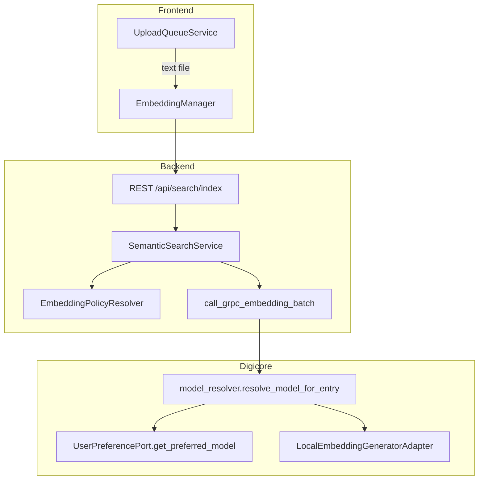

# Embedding Generation End-to-End Audit Plan

## Scope

Audit the complete code trace flow for embedding generation when media (text, audio, image, video) is uploaded/imported, with emphasis on **user preferred embedding models per media type** (e.g., `preferred_image_visual_model`, `preferred_audio_waveform_model`, `preferred_video_frame_model`).

## Key Sources Already Identified

| Document/File | Purpose |
|--------------|---------|
| [EMBEDDING_MANAGEMENT_END_TO_END_AUDIT_FINDINGS.md](digicore_semantic_search_services/docs/EMBEDDING_MANAGEMENT_END_TO_END_AUDIT_FINDINGS.md) | Existing audit (Dec 2025) - critical gaps for user preferences |
| [EMBEDDING_TYPE_POPULATION_ANALYSIS.md](digicore_semantic_search_services/docs/EMBEDDING_TYPE_POPULATION_ANALYSIS.md) | Embedding type matrix per modality |
| [preferences/models.py](CLIPS_rust/clipboard_monitor_srvcs/postgres/src/python_api/semantic_search/preferences/models.py) | `EmbeddingPreference` with `get_image_model()`, `get_audio_model()`, `get_video_model()` |
| [user_preference_adapter.py](digicore_semantic_search_services/digicore_semantic_search_service/infrastructure/adapters/user_preference_adapter.py) | `get_preferred_model(user_id, modality, embedding_type)` |
| [text_file_service.py](digicore_semantic_search_services/digicore_semantic_search_service/domain/text_file_service.py) | Uses `embedding_models.default_text` - **no user_id** |
| [upload-queue.service.ts](MortikAI_suite_angular/projects/shared-services/src/lib/ai-semantic-engine/upload-queue.service.ts) | Frontend text file embedding - passes `undefined` for model (expects backend) |

## End-to-End Flow Summary (To Document)

## Gaps to Document (From Research)

1. **Text file upload (frontend path)**: `UploadQueueService.generateTextFileEmbedding()` calls `embeddingManager.generate(entryId, content, EntityType.CLIPBOARD_ENTRY, undefined)` - model is undefined; backend should resolve via user preference but flow differs from clipboard.

2. **Text file upload (TextFileService path)**: Uses `embedding_models.default_text` from DynamicConfig; **no user_id passed**; user preference never consulted. See [text_file_service.py](digicore_semantic_search_services/digicore_semantic_search_service/domain/text_file_service.py) lines 218-226.

3. **Image/Audio/Video pipelines**: `EmbeddingPolicyResolver` resolves preferences, but resolved `preferred_image_model`, `preferred_audio_model`, `preferred_video_model` are **not passed** to `CLIPPipeline`, `AudioPipeline`, `VideoPipeline`. Pipelines use default models from strategy.

4. **Per-embedding-type preferences**: User has `preferred_image_visual_model`, `preferred_image_text_model`, `preferred_audio_waveform_model`, `preferred_video_frame_model`, etc. `PostgresUserPreferenceAdapter.get_preferred_model(user_id, modality, embedding_type)` supports these, but callers often pass only modality or use legacy single-model resolution.

5. **UnifiedEmbeddingGenerator._select_model()**: Logs "User preference lookup will be handled by backend adapter" but does not actually perform lookup; relies on adapter chain.

6. **Provider credentials**: EMBEDDING_PROVIDER_CREDENTIALS_GUIDE notes that DB credentials from UI are **not yet used** by SentenceTransformersStrategy for model loading (HF_TOKEN workaround required).

## Output Document Structure

**File**: `docs/audits_findings_analysis/EMBEDDING_GENERATION_UPLOAD_MEDIA_E2E_AUDIT.md`

1. **Executive Summary** - Key findings, severity matrix
2. **End-to-End Flow by Media Type** - Text, Image, Audio, Video with mermaid diagrams
3. **User Preference Model Reference** - Embedding type to preference field mapping table
4. **Gaps and Issues** - Each gap with location, impact, root cause
5. **Alternative Options** - Per gap: Option A/B with pros/cons
6. **SWOT Analysis**
7. **Key Decisions Requiring Input** - Numbered decisions with options and recommendation

## Implementation Approach

- Create the markdown file in one write operation
- Reference existing docs (EMBEDDING_MANAGEMENT_END_TO_END_AUDIT_FINDINGS, EMBEDDING_TYPE_POPULATION_ANALYSIS) for cross-linking
- Use mermaid diagrams for flow visualization (following syntax rules from system prompt)
- Ensure no emojis in plan/document per guidelines
