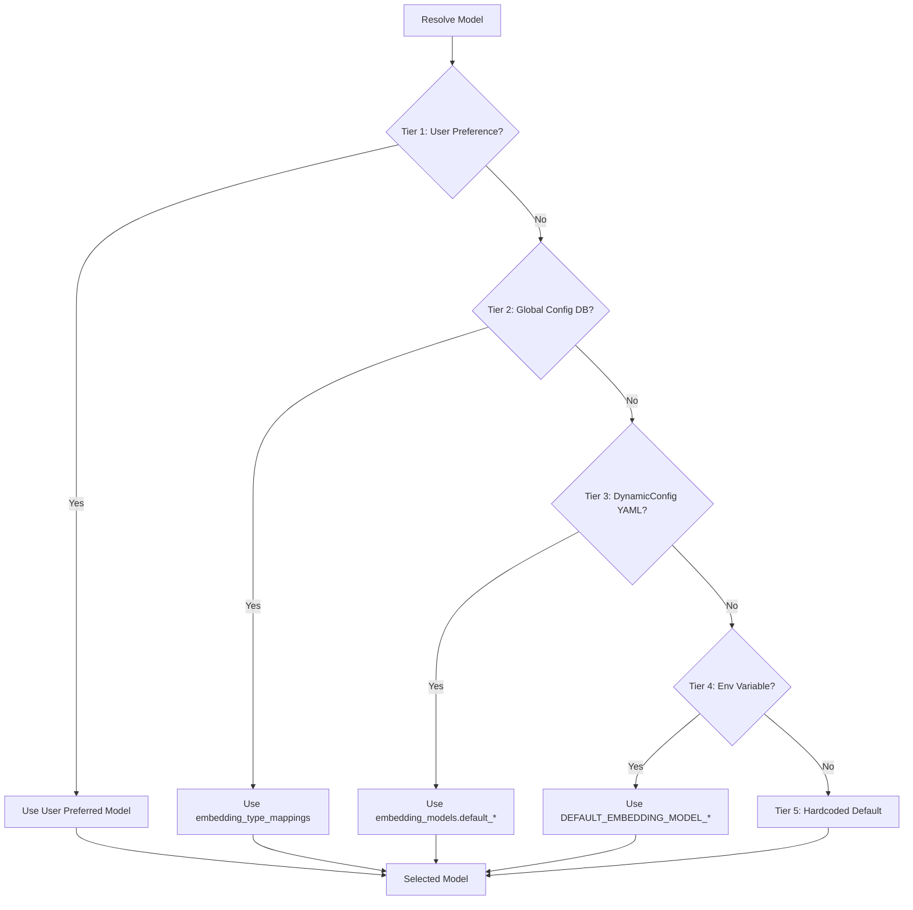
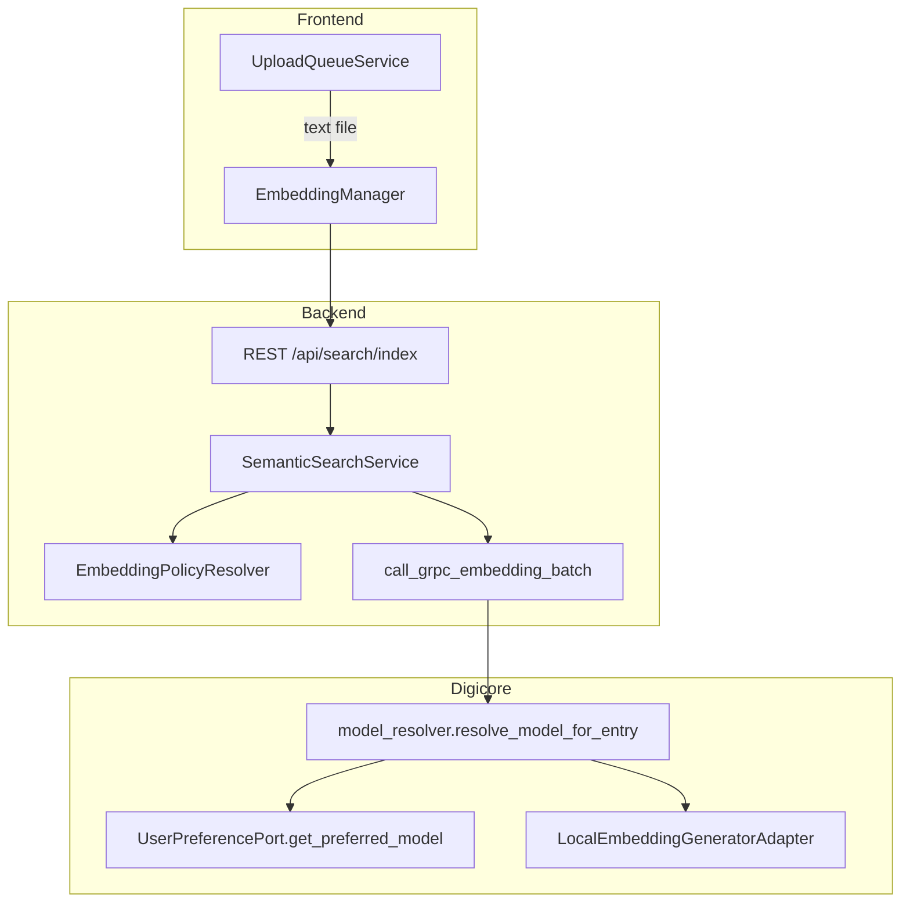

# Embedding Generation End-to-End Audit Plan

## Scope

Audit the complete code trace flow for embedding generation when media (text, audio, image, video) is uploaded/imported, with emphasis on **user preferred embedding models per media type** (e.g., `preferred_image_visual_model`, `preferred_audio_waveform_model`, `preferred_video_frame_model`).

## Configuration-First Prioritization Hierarchy (CRITICAL)

All proposed fixes must **enhance** (not replace) existing configuration. DynamicConfig (`_runtime_config.yaml`) and the full fallback chain remain in use. When user has a preferred model configured, it takes priority; otherwise the system falls through the hierarchy.

**Required Priority Order (highest to lowest):**

1. **User Preference** - Per-user, per-modality, per-embedding_type (e.g., `preferred_image_visual_model`)
2. **Global Configurations (DB)** - `embedding_type_mappings` table, `embedding_model_catalog`
3. **YAML Configuration** - `_runtime_config.yaml` (DynamicConfig) - `embedding_models.default_*`, `multi_embedding.*`
4. **Environment Variables** - `.env` (e.g., `DEFAULT_EMBEDDING_MODEL_TEXT`, `HF_TOKEN`)
5. **Hardcoded Default** - Last-resort fallback in code

**Principle:** Add user preference as Tier 1 where missing; preserve DynamicConfig and all lower tiers as fallbacks. Never remove DynamicConfig usage.

## Key Sources Already Identified

| Document/File                                                                                                                                       | Purpose                                                                                  |
| --------------------------------------------------------------------------------------------------------------------------------------------------- | ---------------------------------------------------------------------------------------- |
| [EMBEDDING_MANAGEMENT_END_TO_END_AUDIT_FINDINGS.md](digicore_semantic_search_services/docs/EMBEDDING_MANAGEMENT_END_TO_END_AUDIT_FINDINGS.md)       | Existing audit (Dec 2025) - critical gaps for user preferences                           |
| [EMBEDDING_TYPE_POPULATION_ANALYSIS.md](digicore_semantic_search_services/docs/EMBEDDING_TYPE_POPULATION_ANALYSIS.md)                               | Embedding type matrix per modality                                                       |
| [preferences/models.py](CLIPS_rust/clipboard_monitor_srvcs/postgres/src/python_api/semantic_search/preferences/models.py)                           | `EmbeddingPreference` with `get_image_model()`, `get_audio_model()`, `get_video_model()` |
| [user_preference_adapter.py](digicore_semantic_search_services/digicore_semantic_search_service/infrastructure/adapters/user_preference_adapter.py) | `get_preferred_model(user_id, modality, embedding_type)`                                 |
| [text_file_service.py](digicore_semantic_search_services/digicore_semantic_search_service/domain/text_file_service.py)                              | Uses `embedding_models.default_text` - **no user_id**                                    |
| [upload-queue.service.ts](MortikAI_suite_angular/projects/shared-services/src/lib/ai-semantic-engine/upload-queue.service.ts)                       | Frontend text file embedding - passes `undefined` for model (expects backend)            |

## End-to-End Flow Summary (To Document)

## Gaps to Document (From Research)

1. **Text file upload (frontend path)**: `UploadQueueService.generateTextFileEmbedding()` calls `embeddingManager.generate(entryId, content, EntityType.CLIPBOARD_ENTRY, undefined)` - model is undefined; backend should resolve via user preference but flow differs from clipboard.
2. **Text file upload (TextFileService path)**: Uses `embedding_models.default_text` from DynamicConfig; **no user_id passed**; user preference never consulted. **Fix:** Add UserPreferencePort; check user preference first (Tier 1); if None, fall through to DynamicConfig (Tier 3) - keep existing.
3. **Image/Audio/Video pipelines**: `EmbeddingPolicyResolver` resolves preferences, but resolved models are **not passed** to pipelines. Pipelines use strategy defaults. **Fix:** Pass user-preferred model when available (Tier 1); pipelines fall back to DynamicConfig/DB/env/hardcoded when not.
4. **Per-embedding-type preferences**: Callers often omit `embedding_type` when resolving. **Fix:** Ensure callers pass embedding_type; resolution falls through to DB (Tier 2), YAML (Tier 3), env (Tier 4), hardcoded (Tier 5) when user has no preference.
5. **UnifiedEmbeddingGenerator._select_model()**: Does not perform user lookup. **Fix:** Add UserPreferencePort call when user_id present (Tier 1); if None, fall through to DynamicConfig (existing chain).
6. **Provider credentials**: DB credentials from UI not used. **Fix:** Add DB credential lookup (Tier 2); fall back to HF_TOKEN env (Tier 4) when not found.

## Output Document Structure

**File**: `docs/audits_findings_analysis/EMBEDDING_GENERATION_UPLOAD_MEDIA_E2E_AUDIT.md`

1. **Executive Summary** - Key findings, severity matrix
2. **End-to-End Flow by Media Type** - Text, Image, Audio, Video with mermaid diagrams
3. **User Preference Model Reference** - Embedding type to preference field mapping table
4. **Gaps and Issues** - Each gap with location, impact, root cause
5. **Alternative Options** - Per gap: Option A/B with pros/cons
6. **SWOT Analysis**
7. **Key Decisions Requiring Input** - Numbered decisions with options and recommendation

## Implementation Plan (Approved Choices)

**Exclusions:** GAP-3 Option C, GAP-5 Option C, GAP-6 Option A.

| Gap | Selected Option | Approach |
|-----|-----------------|----------|
| GAP-1 | A | Add UserPreferencePort to TextFileService; user_id in TextFileUploadRequest; resolve Tier 1 first, fall through to DynamicConfig |
| GAP-2 | A | Backend POST /api/search/index receives user_id from auth; resolves via EmbeddingPolicyResolver for text modality |
| GAP-3 | A | Add user_preferred_model to pipeline constructors; service passes resolved preferences; pipelines fall back to DynamicConfig/DB/env/hardcoded |
| GAP-4 | B | Batch-fetch get_all_preferences(user_id) once; map embedding_type to model in memory |
| GAP-5 | A | Inject UserPreferencePort into UnifiedEmbeddingGenerator; _select_model() calls it (Tier 1); fall through to DynamicConfig when None |
| GAP-6 | C | Hybrid: try DB (Tier 2) first, fall back to HF_TOKEN (Tier 4) |

**Decisions (Confirmed):**

| Decision | Choice | Notes |
|----------|--------|-------|
| 1. TextFileService User Context | A | Add user_id and UserPreferencePort |
| 2. Pipeline Interface Change | A | Constructor parameter for user_preferred_model |
| 3. Per-Embedding-Type Resolution | B | Batch fetch get_all_preferences |
| 4. Provider Credentials Integration | C | Hybrid: DB first, HF_TOKEN fallback |
| 5. Implementation Priority | Suggested order | GAP-3, GAP-4, GAP-1, GAP-5, GAP-2, GAP-6 |

**Conflict Check:** No conflicts. Decision 2 (A) aligns with GAP-3 (A). Decision 3 (B) aligns with GAP-4 (B). Decision 4 (C) aligns with GAP-6 (C).

**Implementation Order:**

1. GAP-3 (pipelines) + GAP-4 (per-type) - highest impact
2. GAP-1 (TextFileService)
3. GAP-5 (UnifiedEmbeddingGenerator)
4. GAP-2 (Frontend text upload resolution)
5. GAP-6 (Provider credentials hybrid)

---

## Implementation Approach

- Create the markdown file in one write operation
- Reference existing docs (EMBEDDING_MANAGEMENT_END_TO_END_AUDIT_FINDINGS, EMBEDDING_TYPE_POPULATION_ANALYSIS) for cross-linking
- Use mermaid diagrams for flow visualization (following syntax rules from system prompt)
- Ensure no emojis in plan/document per guidelines
- **Configuration-First:** For each gap fix, add user preference (Tier 1) where missing; preserve DynamicConfig and full fallback chain (DB, YAML, env, hardcoded). Never remove or bypass DynamicConfig.

