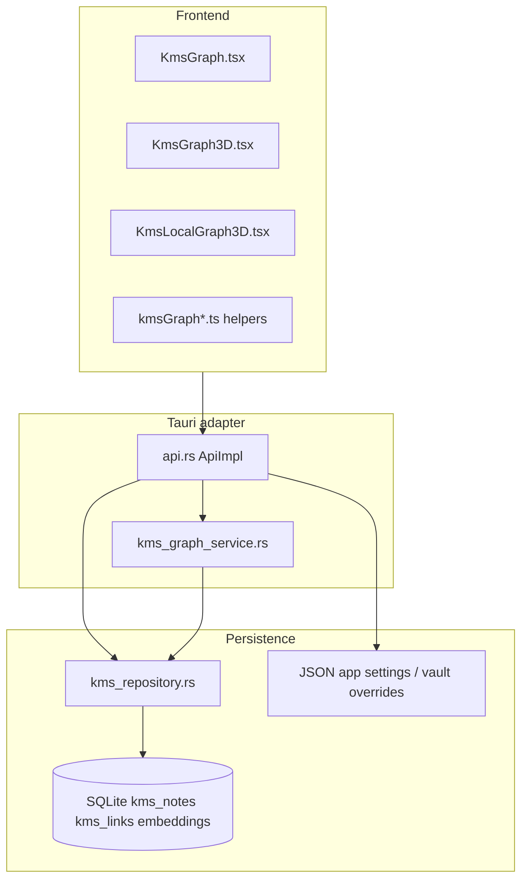

# KMS Knowledge Graph and Local Graph: Audit, Gaps, and Implementation Plan

> Doc governance status: Legacy/Stale-first (historical reference)
> Prefer canonical sources: `knowledge-graph-comprehensive-audit-and-roadmap-2026-03.md`, `kms-notebook-capabilities-audit-and-implementation-plan-2026-04.md`
> Governance map: `kms-graph-doc-governance-map-2026-04.md`

**Document date:** 2026-03-28  
**Scope:** Global Knowledge Graph (`kms_get_graph`), Local Graph (`kms_get_local_graph`), shortest-path IPC, related UI (2D/3D, local 3D), configuration, diagnostics, and alignment with hexagonal architecture, configuration-first design, SOLID, and SRP.

**Related documents:** `knowledge-graph-features-audit-and-implementation-plan.md` (earlier baseline), `prd-kms-graph-paged-view-and-per-vault-overrides.md`, `kms_graph_3.0_roadmap.md`, `kms-graph-prd-progress.md`, `kms-graph-island-legend-followup-scope.md`.

---

## 1. Executive summary

The Knowledge Graph stack has matured since the first audit: graph assembly, k-means, semantic beams, PageRank, undirected shortest path, **path-ordered pagination** for large vaults, **per-vault JSON overrides**, structured **IPC error codes** (`ipc_error` + `ipcError.ts`), and a dedicated **`kms_graph_service.rs`** module with unit tests. The UI layer gained session paging helpers (`kmsGraphPaging.ts`), island/component analysis (`kmsGraphIslands.ts`), legend and visual prefs, constellation backdrop, and consistent error formatting via `formatIpcOrRaw`.

Remaining gaps cluster around **(a)** hexagonal layering (service vs adapter vs repository boundaries still blur in places), **(b)** **scale** (full-graph PageRank over all notes before pagination slice, O(n^2) beam search within budgets, local graph full DB scan), and **(c)** **observability** (correlation IDs, structured frontend logging). **Update (v1.1):** local/global embedding failures surface **DTO warnings** and logs; **PageRank** is configurable; **paged** requests use **page-limited** semantics; AI beams use **cosine** similarity.

This document records findings, SWOT, implementation alternatives, **recorded stakeholder decisions (section 7)**, and a **phased plan** that stays compatible with your architecture goals.

---

## 2. Current architecture (as implemented)

| Concern | Location | Notes |
|--------|----------|--------|
| Wiki link graph | `kms_repository` + `build_full_graph` | Directed links stored; several algorithms treat graph as undirected. |
| Semantic layer | `kms_graph_service::semantic_clustering_and_beams`, `cluster_subgraph_from_embeddings` | k-means + optional cross-cluster beams; local graph skips beams. |
| Local neighborhood | `local_neighborhood_edges`, BFS with deduplicated directed edge keys | Fixes duplicate edge rows from multi-visit BFS. |
| Centrality | `undirected_pagerank` | Normalized 0..1; iterations fixed in code (32 local, 48 global). |
| Pathfinding | `shortest_path_undirected_wiki` | BFS on undirected wiki adjacency; returns vault-relative chain. |
| Pagination | `build_full_graph` + `KmsGraphPaginationDto` | `limit == 0` means full graph; slice sorts nodes by `abs_path`. |
| Settings | `AppState` / `storage_keys` / `effective_graph_build_params` | Global keys + `kms_graph_vault_overrides_json` merged by vault key. |
| IPC errors | `ipc_error` in `api.rs`, `KMS_*` codes in `ipcError.ts` | JSON-shaped `Err` strings parsed on the client. |

---

## 3. Feature inventory

### 3.1 Global Knowledge Graph

- Load graph with optional **offset/limit** paging; auto-paging thresholds in settings; session state in `localStorage` (`kmsGraphPaging.ts`).
- Nodes: path, title, type heuristic (`note` / `skill` / `image`), folder, modified time, optional `cluster_id`, `link_centrality`.
- Edges: resolved absolute paths from vault-relative link rows.
- **Cluster labels:** medoid-from-embedding titles merged with keyword labels; fallback `Topic {id}`.
- **AI beams:** cross-cluster high dot-product pairs (configurable caps and pair-check budget); warnings when budget exhausted or semantics skipped due to `semantic_max_notes`.
- **Warnings array** on DTO for user-visible soft failures (large vault, skipped semantics, beam budget).
- **Shortest path** in UI using `kms_get_graph_shortest_path` + helpers in `kmsGraphHelpers.ts`.
- Visual enhancements: bloom, hex grid prefs, legend visibility, islands, pulse, folder palette (see `src/lib` and `KmsGraphConstellationBackdrop.tsx`).

### 3.2 Local Graph

- **Input:** vault-relative or resolvable path + depth.
- Loads **all** notes and links from DB, builds adjacency, BFS to depth, dedupes edges, filters notes in visited set.
- Optional **local-only clustering** on embeddings intersecting the neighborhood; **no** AI beams on local DTO.
- PageRank on the **local** subgraph only (`iterations: 32` in adapter).
- Does not populate `warnings` today; embedding errors are swallowed (see section 4).

### 3.3 Configuration and exports

- Broad `kms_graph_*` surface on `AppState` (clustering, beams, caps, auto paging, bloom, hex visuals, vault overrides JSON).
- Settings bundle group `kms_graph` for import/export alignment.

---

## 4. Detailed findings

### 4.1 Hexagonal architecture and SOLID

**Strengths**

- `kms_graph_service.rs` concentrates **pure or repository-backed graph logic** (k-means, beams, BFS neighborhood, PageRank, shortest path, full-graph build) and documents hexagonal intent in its module header.
- IPC adapter remains a thin orchestrator for `kms_get_graph` (spawn_blocking, diagnostics, DTO mapping).

**Gaps**

- **`ApiImpl::kms_get_local_graph`** still orchestrates repository calls, embedding filter, DTO assembly, and PageRank. For SRP parity with global graph, a `build_local_graph(...)` in `kms_graph_service` (or a sibling `kms_local_graph_service`) would keep the adapter to locking + mapping only.
- **`node_type_and_folder`** is shared in the service but similar path heuristics may still exist elsewhere; a single port-level helper (or domain value object) avoids drift.
- **Domain vs adapter:** `KmsGraphBuildParams` is a good value object; there is no explicit Rust **port trait** for "graph read model" that the Tauri layer implements, which would make testing and future alternate backends (e.g. cached graph) cleaner.

### 4.2 Configuration-first

**Strengths**

- Semantic caps, beam limits, paging, bloom, hex, and vault overrides are persisted and exposed through app configuration flows.

**Gaps**

- **PageRank:** iterations and damping are **user-configurable** (`kms_graph_pagerank_iterations`, `kms_graph_pagerank_local_iterations`, `kms_graph_pagerank_damping`) as of v1.1.
- **AI beams:** cross-cluster similarity uses **cosine similarity**; threshold remains 0..1 on the cosine scale.

### 4.3 Reliability and error handling

**Strengths**

- `kms_get_graph` surfaces build failures as `KMS_GRAPH_BUILD` / `KMS_GRAPH_WORKER`; lock failures as `KMS_STATE_LOCK`.
- Full graph logs embedding load failures via `KmsDiagnosticService::warn` and continues without clusters.
- Frontend graph components use `formatIpcOrRaw` for readable messages.

**Gaps**

- **`kms_get_local_graph`:** embedding load failures now log at WARN and append **`warnings`** on the DTO (aligned with global graph UX as of v1.1).
- **Paged + pathfinding:** PRD already calls out UX when the shortest path leaves the current page; verify all code paths show a clear notice (regression risk as features evolve).
- **Invalid center path for local graph:** Behavior depends on BFS not finding the node; explicit validation + `KMS_NOTE_NOT_INDEXED` or dedicated code would match shortest-path style errors.

### 4.4 Performance and scale

- **Full note/link scans** for every local graph request: acceptable for small/medium vaults; for large vaults, consider **SQL-scoped** neighborhood query or caching adjacency.
- **Global graph:** Pagination reduces payload size; clustering still runs on **full** embedding set before slice when semantics enabled (by design in `build_full_graph`), so CPU cost may remain high for huge vaults even when UI requests one page.
- **Beams:** Pair budget limits worst case; true **ANN** (sqlite-vec, etc.) would scale better for similarity edges.

### 4.5 Consistency and correctness

- **Path normalization:** Multiple layers normalize `\` to `/` and lowercase for matching; embedding `cluster_map` keys must stay aligned with `kms_notes.path` (documented risk in prior audit remains relevant).
- **Undirected vs directed:** Shortest path and PageRank use undirected views; stored links are directed. Product assumption should stay explicit in docs and UI tooltips.
- **Paging sort:** Stable path sort is good for reproducibility; it is **not** "most connected first," which may surprise users unless labeled.

### 4.6 Frontend maintainability

- Large components (`KmsGraph3D.tsx`, `KmsLocalGraph3D.tsx`, `KmsGraph.tsx`) carry simulation, camera, legend, path UI, and data loading. Further decomposition into hooks-only modules (data layer vs scene layer) would improve SRP and testability without changing behavior.

---

## 5. SWOT

| | Helpful | Harmful |
|---|---------|---------|
| **Strengths** | Local-first SQLite; unified DTO; real wiki links; optional semantics; rich 3D/2D UX; ipc error codes; vault overrides; unit tests on graph algorithms. | |
| **Weaknesses** | Fat local handler; very large UI files; full-graph PageRank before pagination slice; paged semantics still run full `get_all_note_embeddings` I/O. | |
| **Opportunities** | Extract local build to service; structured logging + correlation; SQL neighborhood; materialized/cached graph; ANN for beams; optional WASM layout. | |
| **Threats** | Very large vaults + synchronous blocking work; user distrust if clustering "randomly" disappears without explanation; DTO/schema drift if bindings diverge from Rust. | |

---

## 6. Alternative approaches (options, pros, cons)

| Option | Summary | Pros | Cons |
|--------|---------|------|------|
| **A. Incremental hardening (recommended default)** | Tighten logging, local warnings, extract `build_local_graph`, add tests | Low risk; fits current stack | Does not alone fix largest-vault CPU |
| **B. SQL neighborhood for local graph** | Recursive CTE or repeated join bounded by depth | Less Rust memory; faster for huge vaults | Still need path normalization; more SQL complexity |
| **C. Materialized graph snapshot** | Table or file updated on index change | Fast reads | Invalidation pipeline; migration; stale risk |
| **D. Background worker + cache** | Build DTO async; versioned cache | Smoother UI | Invalidation, locking, complexity |
| **E. ANN / vector extension for beams** | sqlite-vec or similar for top-k similar cross-cluster | Scales similarity | New dependency; ops tuning |
| **F. Client-side only layout** | Server sends nodes/edges; physics in browser | Thinner physics server | Clustering/beams still need server if secrets/embeddings stay local |
| **G. Separate microservice for graph** | HTTP graph API | Independent scale | Conflicts with local-first Tauri app unless optional remote mode |

---

## 7. Recorded stakeholder decisions (2026-03-28)

| Topic | Decision |
|-------|----------|
| Local graph embedding failure | Match global behavior: **`KmsDiagnosticService::warn`** plus a **`warnings` string on `KmsGraphDto`** when embedding load fails and semantic clustering is skipped. |
| Semantics vs pagination | **Page-limited (and capped) semantics:** when `kms_get_graph` uses paged mode (`limit > 0`), k-means and AI beams run only on embeddings for notes on that path-sorted page; `semantic_max_notes` truncates by path order within the page. User-facing warnings explain non-comparability across pages. Full-graph mode keeps the prior vault-wide skip when note count exceeds `semantic_max_notes`. |
| PageRank tunables | Exposed in **Configurations and Settings > Knowledge Graph** and in **per-vault overrides**: `kms_graph_pagerank_iterations`, `kms_graph_pagerank_local_iterations`, `kms_graph_pagerank_damping` (persisted in JSON storage and settings bundles). |
| Beam similarity metric | **Use cosine similarity** for AI beam thresholds (implementation updated). See **7.1** for normalization notes and performance. |
| Local graph scale target | **Thousands** of indexed notes: full scan for local BFS remains acceptable short-term; **SQL-scoped neighborhood** (plan L3.1) remains the next scale step if latency regresses. |
| Remote / multi-device | **Server-side graph index** anticipated later: treat current SQLite-backed builder as the **local adapter**; future **port + remote implementation** should reuse the same DTO contracts where possible. |

### 7.1 Beam metric: recommendation (question 4)

- **Stored vectors:** Note embeddings are produced by `fastembed` / **BGE-small-en-v1.5** (`embedding_service.rs`) and stored as raw `f32` blobs. The pipeline does **not** re-normalize in Rust on read or write; many embedding APIs return **approximately unit-norm** vectors, but that is **not guaranteed** for all models or future providers.
- **Robustness:** **Cosine similarity** (equivalent to dot product when vectors are unit length) is the right semantic for "direction" of meaning. Raw **dot product** favors longer vectors and is **not** robust if L2 norms drift.
- **Performance at large N:** Beam search is already bounded by **`ai_beam_max_nodes`** and **`beam_max_pair_checks`**. Each candidate pair costs **O(d)** for both dot and cosine (cosine = dot / (||a|| ||b||); norms can be **precomputed once per vector** if this loop becomes hot). Dominant cost remains the **pair enumeration**, not the similarity formula.

---

## 8. Implementation plan (phased)

### Phase L0: Observability and parity (short)

| Item | Action | Acceptance |
|------|--------|------------|
| L0.1 | On local graph embedding `Err`, call `KmsDiagnosticService::warn` and append a `warnings` entry on `KmsGraphDto` | **Done** (2026-03-28). Global graph also adds a DTO warning on embedding load failure. |
| L0.2 | Optional: validate local center path indexed; return structured IPC error consistent with `KMS_NOTE_NOT_INDEXED` where applicable | **Done** (2026-03-28): `kms_get_local_graph` checks minimal index + canonical path; returns `KMS_NOTE_NOT_INDEXED` when missing. |
| L0.3 | Add Rust unit test or integration test for local neighborhood deduplication regression | **Done** (2026-03-28): unit tests for duplicate directed-row dedup and incremental vs full BFS parity (`kms_graph_service` tests). |

### Phase L1: Hexagonal cleanup (medium)

| Item | Action | Acceptance |
|------|--------|------------|
| L1.1 | Introduce `build_local_graph` in `kms_graph_service` taking vault, center rel path, depth, params; `api.rs` only resolves paths, locks state, maps DTO | **Done** (2026-03-28): `build_local_graph` + `BuiltLocalGraph`; IPC maps via `built_local_to_kms_graph_dto`. |
| L1.2 | Document in module comments which operations are **undirected** vs **directed** | **Done** (2026-03-28): module-level note in `kms_graph_service.rs`. |
| L1.3 | Align beam metric with product (dot vs cosine) and update user-facing strings | **Done:** cosine for beams; Config help text updated. |

### Phase L2: Configuration and robustness (medium)

| Item | Action | Acceptance |
|------|--------|------------|
| L2.1 | AppState keys for PageRank iterations (global/local) and damping with safe clamps | **Done** (2026-03-28): `kms_graph_pagerank_*` in settings, vault overrides, and bundles. |
| L2.2 | Frontend: map known `KMS_*` codes to tailored UI hints where helpful (not only raw message) | **Done** (2026-03-28): `KMS_IPC_HINTS` in `ipcError.ts` appended by `formatIpcOrRaw` (used by graph UIs). |
| L2.3 | Consider `tracing` spans or structured fields around `build_full_graph` duration, note counts, semantic skip flags | **Done** (2026-03-28): `duration_ms` on `build_full_graph` / `build_local_graph` INFO logs; counts and skip flags already logged. |

### Phase L3: Scale and features (longer horizon)

| Item | Action | Acceptance |
|------|--------|------------|
| L3.1 | Prototype SQL-scoped local neighborhood; benchmark vs full scan | **Done (prototype)** (2026-03-28): incremental BFS calls `get_links_for_notes` per frontier instead of loading all links; optional future: single recursive CTE / formal benchmarks. |
| L3.2 | Page-only semantics for paged `kms_get_graph` | **Done** (2026-03-28): path-sorted page slice drives embedding subset; optional truncation via `semantic_max_notes`. |
| L3.3 | Evaluate ANN for beams behind `kms_graph_enable_ai_beams` | **Deferred:** beam search remains bounded exhaustive over capped nodes; ANN evaluation tracked as a future experiment when vault scale demands it. |

---

## 9. Diagnostic logging checklist (target state)

- **INFO:** Graph build complete with counts (nodes, edges, clustered count, beams, paging meta) -- largely present for global path.
- **WARN:** Embedding load failure (global and local); vault overrides JSON parse failure (already coded on some paths); beam pair budget exhausted (surfaced as DTO warning + log).
- **DEBUG:** Empty vault; optional verbose BFS depth stats for local graph during development.
- **Correlation:** If you add request IDs from UI to IPC, log the same ID in Rust for support tickets.

---

## 10. Appendix: primary file index

| Area | Path |
|------|------|
| Graph service | `digicore/tauri-app/src-tauri/src/kms_graph_service.rs` |
| IPC + settings merge | `digicore/tauri-app/src-tauri/src/api.rs` |
| Repository / SQL | `digicore/tauri-app/src-tauri/src/kms_repository.rs` |
| IPC error helpers | `digicore/tauri-app/src/lib/ipcError.ts` |
| Paging session | `digicore/tauri-app/src/lib/kmsGraphPaging.ts` |
| Islands / components | `digicore/tauri-app/src/lib/kmsGraphIslands.ts` |
| Path / edge helpers | `digicore/tauri-app/src/lib/kmsGraphHelpers.ts` |
| DTO types (generated) | `digicore/tauri-app/src/bindings.ts` |
| UI | `KmsGraph.tsx`, `KmsGraph3D.tsx`, `KmsLocalGraph3D.tsx` |

---

## 11. Changelog of this document

| Version | Date | Summary |
|---------|------|---------|
| 1.0 | 2026-03-28 | Initial standalone audit aligned with current `kms_graph_service`, IPC errors, paging, and local graph behavior. |
| 1.1 | 2026-03-28 | Stakeholder decisions recorded; cosine beams; paged semantics; PageRank settings; local/global embedding failure warnings on DTO. |
| 1.2 | 2026-03-28 | Section 8 closure: local indexed-center IPC, incremental SQL-scoped BFS, Rust dedup/parity tests, build duration logging, frontend IPC hints. L3.3 explicitly deferred. |
