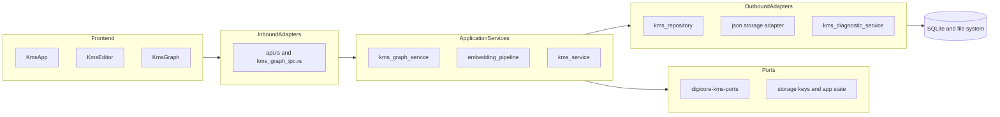

# KMS and Notebook Capabilities Audit and Implementation Plan (2026-04)

> Doc governance status: Canonical (current implementation cycle tracker)
> Canonical technical baseline: `knowledge-graph-comprehensive-audit-and-roadmap-2026-03.md`
> Governance map: `kms-graph-doc-governance-map-2026-04.md`

## 1) Purpose and Scope

This document is a standalone audit and implementation blueprint for DigiCore KMS and notebook/note capabilities. It focuses on:

- Current implemented capabilities across backend, frontend, and configuration surfaces.
- Architectural fit with hexagonal architecture, configuration-first design, SOLID, and SRP.
- Reliability, error handling, and diagnostic logging maturity.
- Concrete enhancement opportunities with alternatives, pros and cons, and tradeoffs.
- SWOT analysis and explicit decision points requiring stakeholder input.
- A phased implementation plan (P0/P1/P2) with rollout and verification guidance.

Primary references:

- [digicore/tauri-app/src-tauri/src/api.rs](digicore/tauri-app/src-tauri/src/api.rs)
- [digicore/tauri-app/src-tauri/src/kms_repository.rs](digicore/tauri-app/src-tauri/src/kms_repository.rs)
- [digicore/tauri-app/src-tauri/src/kms_graph_service.rs](digicore/tauri-app/src-tauri/src/kms_graph_service.rs)
- [digicore/tauri-app/src-tauri/src/kms_graph_ports.rs](digicore/tauri-app/src-tauri/src/kms_graph_ports.rs)
- [digicore/tauri-app/src-tauri/src/embedding_pipeline.rs](digicore/tauri-app/src-tauri/src/embedding_pipeline.rs)
- [digicore/tauri-app/src-tauri/src/embedding_service.rs](digicore/tauri-app/src-tauri/src/embedding_service.rs)
- [digicore/tauri-app/src/KmsApp.tsx](digicore/tauri-app/src/KmsApp.tsx)
- [digicore/tauri-app/src/components/kms/KmsEditor.tsx](digicore/tauri-app/src/components/kms/KmsEditor.tsx)
- [digicore/tauri-app/src/components/kms/KmsGraph.tsx](digicore/tauri-app/src/components/kms/KmsGraph.tsx)
- [digicore/tauri-app/src/components/kms/KmsGraph3D.tsx](digicore/tauri-app/src/components/kms/KmsGraph3D.tsx)
- [digicore/tauri-app/src/components/kms/FileExplorer.tsx](digicore/tauri-app/src/components/kms/FileExplorer.tsx)
- [digicore/tauri-app/src/lib/ipcError.ts](digicore/tauri-app/src/lib/ipcError.ts)
- [digicore/crates/digicore-text-expander/src/ports/storage.rs](digicore/crates/digicore-text-expander/src/ports/storage.rs)
- [digicore/crates/digicore-text-expander/src/application/app_state.rs](digicore/crates/digicore-text-expander/src/application/app_state.rs)

Companion docs reviewed:

- [digicore/docs/knowledge-graph-comprehensive-audit-and-roadmap-2026-03.md](digicore/docs/knowledge-graph-comprehensive-audit-and-roadmap-2026-03.md)
- [digicore/docs/kms-embeddings-temporal-graph-semantic-search-hexagonal-plan-2026-03.md](digicore/docs/kms-embeddings-temporal-graph-semantic-search-hexagonal-plan-2026-03.md)
- [digicore/docs/kms-graph-prd-progress.md](digicore/docs/kms-graph-prd-progress.md)
- [digicore/docs/kms-knowledge-graph-and-local-graph-audit-2026-03.md](digicore/docs/kms-knowledge-graph-and-local-graph-audit-2026-03.md)
- [digicore/docs/kms_graph_3.0_roadmap.md](digicore/docs/kms_graph_3.0_roadmap.md)

---

## 2) Executive Findings

The existing KMS and notebook/note stack is feature-rich and already includes graph, semantic search, embeddings, migration flows, diagnostics, and vault-level configurability. The architecture has meaningful hexagonal progress (ports/adapters for graph and embeddings), but high-value work remains around strict boundary enforcement, consistent typed errors, cross-layer observability, and large-vault performance.

Top findings:

1. Strong baseline capabilities are shipped end-to-end for notes, graph, local graph, search, embeddings, and health diagnostics.
2. Hexagonal boundaries are partial: service and port abstractions exist, but orchestration remains concentrated in large adapter-level surfaces.
3. Reliability is mixed: some paths gracefully degrade with warnings and logs, while others still return weakly structured errors or allow silent partial failures.
4. Diagnostics are present but not yet consistently correlated across all KMS RPC flows.
5. Graph and semantic features are robust for small-to-medium vaults, but cost patterns for very large vaults need intentional scaling controls.

---

## 3) Current-State Capability Inventory

### 3.1 Notes and Notebooks

- Notes are managed as vault files with metadata and indexing.
- In current UX terminology, a "notebook" is represented as a folder in the vault explorer.
- Core note operations are implemented: list/load/save/create/rename/delete/move.
- Wiki-link relationships are extracted and used in graph and related-note workflows.

### 3.2 Search and Embeddings

- Hybrid and semantic search is available, with configurable thresholds and limits.
- Embeddings are generated with fastembed-based pipelines and persisted for retrieval.
- Migration flows exist for re-embedding with progress events and cancellation support.
- Chunking and embedding policy controls are available through config and service logic.

### 3.3 Graph and Local Graph

- Global graph supports paging/full modes, pathing, exports, and multiple visual layers (2D/3D).
- Local graph supports neighborhood exploration around a target note.
- Additional graph enrichments include centrality and semantic enhancements (where enabled).
- Graph client utilities already support legend preferences, filters, and debugging helper payloads.

### 3.4 Diagnostics and Operations

- KMS diagnostics and logging tables/services are present.
- Dedicated embedding diagnostics log path exists.
- Health and export tooling is exposed in frontend KMS components.
- Boot-time sync and indexing orchestration are implemented.

---

## 4) Architecture Assessment (Hexagonal, Config-First, SOLID/SRP)

Assessment summary:

- **Hexagonal progress:** Good trajectory with dedicated ports and adapter wrappers in graph and embedding flows.
- **Primary gap:** Very large inbound adapter surfaces still coordinate substantial behavior and contracts.
- **Config-first maturity:** Strong; KMS settings are persisted and surfaced, including vault overrides.
- **SOLID/SRP maturity:** Moderate; improvements needed in decomposition of very large files and cross-cutting concerns (error mapping, telemetry, DTO contracts).

---

## 5) Reliability, Error Handling, and Diagnostic Logging Audit

### 5.1 Strengths

- Structured IPC error formatting exists on key frontend surfaces.
- Server-side graph/embedding diagnostics are already implemented.
- Graceful degradation behavior exists in multiple semantic/graph paths with warning-style outputs.
- Background migration and progress reporting patterns already exist.

### 5.2 Improvement Areas

- Unify typed error contracts across ports/services/repository boundaries (reduce `String`-only error surfaces).
- Eliminate silent failure patterns in note/file mutation and indexing orchestration paths.
- Standardize correlation/request IDs across all KMS flows (not only selected graph operations).
- Enforce consistent frontend error formatting across note/search/graph/config operations.
- Add diagnostic event taxonomy and severity conventions for KMS lifecycle events.

### 5.3 Recommended Logging Standard

Implement a KMS logging standard with:

- `request_id` and `vault_id` for every KMS operation.
- stable `event_code` values (example: `KMS_NOTE_SAVE_FAIL`, `KMS_GRAPH_BUILD_WARN`, `KMS_EMBED_MIGRATE_PROGRESS`).
- `severity` (`DEBUG`, `INFO`, `WARN`, `ERROR`) and safe payload metadata.
- consistent sink strategy (console + db + file where appropriate).
- explicit user-facing mapping for recoverable vs blocking failures.

---

## 6) Alternatives and Options (with Pros, Cons, Tradeoffs)

## Option A: Incremental Hardening on Current Architecture (Recommended Default)

- **Description:** Keep current structure, improve reliability, observability, and typed contracts in place.
- **Pros:** Low delivery risk, faster iteration, no major migration.
- **Cons:** Large files and boundary debt remain partially.
- **Tradeoff:** Best near-term ROI; medium long-term maintainability gains.

## Option B: Strict Hexagonal Refactor (Service and Port Extraction)

- **Description:** Split large adapter surfaces and move orchestration into explicit application/domain modules with typed ports.
- **Pros:** Better testability, cleaner dependency direction, long-term maintainability.
- **Cons:** Higher refactor risk and broader regression surface.
- **Tradeoff:** Higher upfront cost for better long-term architecture integrity.

## Option C: Performance-First Graph/Search Pipeline Upgrade

- **Description:** Prioritize large-vault scalability via caching/materialized snapshots/SQL-scoped queries/ANN-like retrieval strategies.
- **Pros:** Immediate user-perceived performance gains for large datasets.
- **Cons:** Increased complexity for invalidation and consistency guarantees.
- **Tradeoff:** Operational complexity versus scale resilience.

## Option D: Hybrid Strategy (A -> C -> B)

- **Description:** Sequence incremental hardening first, targeted scale work second, deeper architectural extraction third.
- **Pros:** Balanced risk profile, measurable milestones, preserves delivery momentum.
- **Cons:** Requires discipline to prevent deferral of structural work.
- **Tradeoff:** Most practical path if roadmap has ongoing feature pressure.

### Recommended Selection

- Adopt **Option D** with explicit stage gates:
  - Stage 1: Reliability and observability hardening.
  - Stage 2: Scale controls and selective performance improvements.
  - Stage 3: Focused boundary and module refactor.

---

## 7) SWOT Analysis

| Category | Items |
|---|---|
| Strengths | Rich shipped feature set, local-first architecture, meaningful port/adapters progress, configurable graph/search/embedding stack, existing diagnostics and migrations. |
| Weaknesses | Large orchestration files, mixed error typing patterns, uneven diagnostics correlation, uneven frontend error handling consistency, heavy component complexity in graph and config surfaces. |
| Opportunities | Typed error unification, request correlation standard, contract governance for bindings, modularization of inbound adapters/UI components, scale-aware graph/search architecture improvements. |
| Threats | Regression risk during broad refactors, vault-size growth causing latency cliffs, doc drift across multiple roadmap files, API/schema drift between Rust and TypeScript contracts. |

---

## 8) Key Decisions Requiring Stakeholder Input

Each decision includes a recommended default to keep execution moving.

1. **Primary roadmap strategy**
   - Options: A, B, C, D from section 6.
   - Recommended default: **Option D**.

2. **Error contract standardization scope**
   - Options: graph-only first, or all KMS operations in first pass.
   - Recommended default: **all KMS operations for new/edited code paths**, graph-first for legacy backlog.

3. **Performance target definition**
   - Options: optimize for medium vaults now, or include explicit large-vault SLOs immediately.
   - Recommended default: define immediate SLO tiers (`small`, `medium`, `large`) and prioritize `large` pain points in Stage 2.

4. **Notebook model direction**
   - Options: keep "notebook equals folder" model, or introduce explicit notebook domain model.
   - Recommended default: keep folder-backed model now; revisit explicit notebook aggregate only if product requirements diverge.

5. **Docs governance model**
   - Options: continue multi-doc updates, or designate one canonical "source of truth" with status mirrors.
   - Recommended default: designate [digicore/docs/knowledge-graph-comprehensive-audit-and-roadmap-2026-03.md](digicore/docs/knowledge-graph-comprehensive-audit-and-roadmap-2026-03.md) as canonical technical baseline until replaced by a new canonical v2.

---

## 9) Phased Implementation Plan (Detailed)

## P0: Reliability and Diagnostic Hardening (Immediate)

Goals:

- Eliminate silent failures.
- Normalize error handling and user messaging.
- Improve observability coverage with minimal architectural disruption.

Workstreams:

1. **Typed error normalization**
   - Introduce or expand unified KMS error mapping at service/port boundaries.
   - Replace `Result<T, String>` style surfaces where feasible with typed errors.
   - Ensure frontend uses a consistent formatter path for note/search/graph/config errors.

2. **Failure propagation and graceful degradation**
   - Audit write paths for ignored filesystem/database failures.
   - Convert partial-success flows into explicit "success with warnings" responses where applicable.
   - Ensure migration/indexing/reporting jobs expose failure detail deterministically.

3. **Diagnostic logging baseline**
   - Add `request_id` propagation pattern for KMS operations.
   - Standardize event code conventions and severity usage.
   - Ensure key failures are logged in both developer and user-actionable channels.

4. **Contract consistency checks**
   - Validate Rust DTO and TypeScript binding parity process.
   - Remove duplicate/unused binding paths or explicitly mark ownership.

P0 acceptance criteria:

- No identified silent failure in core note/search/graph paths.
- Consistent formatted error UX across primary KMS actions.
- Request correlation visible in diagnostics for major RPC flows.

## P1: Scale and Performance Resilience (Near-Term)

Goals:

- Improve behavior for growing vault sizes without full system redesign.

Workstreams:

1. **Graph query and build optimization**
   - Prioritize selective loading/scoping for local graph and path operations.
   - Add budget and fallback behavior to expensive graph operations.
   - Evaluate cache/materialized representations for repeated heavy computations.

2. **Semantic processing guardrails**
   - Ensure semantic caps and warnings remain explicit and predictable.
   - Add deterministic behavior for page-level semantic operations.

3. **Frontend rendering and interaction performance**
   - Decompose large graph components into data hooks and rendering modules.
   - Keep heavy layout work isolated in worker paths where available.

P1 acceptance criteria:

- Measurable latency improvements for selected large-vault scenarios.
- No regression in functional parity for graph, local graph, and search.

## P2: Architectural Consolidation and Long-Term Maintainability (Mid-Term)

Goals:

- Strengthen strict hexagonal boundaries and reduce long-term coupling debt.

Workstreams:

1. **Inbound adapter decomposition**
   - Continue splitting large adapter modules by bounded context.
   - Keep inbound layer focused on transport/mapping/orchestration only.

2. **Domain/application boundary refinement**
   - Move policy and orchestration logic into dedicated services/use-cases.
   - Expand explicit ports where future alternate adapters are likely.

3. **Documentation governance**
   - Add a canonical doc map and stale-doc markers.
   - Keep progress tracker synced to canonical source.

P2 acceptance criteria:

- Reduced high-churn mega-files.
- Clear ownership map for adapters, services, ports, and config contracts.
- Lower regression risk for future feature additions.

---

## 10) Validation and Rollout Strategy

Validation matrix:

- **Unit tests:** graph helpers, error mapping, config parsing, policy normalization.
- **Integration tests:** end-to-end KMS flows for note CRUD, graph load, search, migration.
- **Negative tests:** malformed overrides, missing paths, mismatched embedding metadata, partial index failures.
- **Operational tests:** diagnostics export, migration cancellation/resume, recovery from corrupted or stale state.

Rollout safeguards:

- feature flags for high-risk behavior changes.
- default-safe fallbacks on semantic and graph enhancements.
- compatibility checks for bundle/config schema evolution.
- staged enablement and observational monitoring before broad rollout.

---

## 11) Prioritized Backlog Snapshot

- **P0-H1:** Typed error contract unification for KMS service and IPC boundaries.
- **P0-H2:** End-to-end request correlation and event code standard.
- **P0-H3:** Frontend-wide adoption of structured IPC error formatting.
- **P1-H1:** Local graph/path operation scope optimization for large vaults.
- **P1-H2:** Semantic processing budget and fallback hardening with user-facing warning parity.
- **P2-H1:** Further decomposition of inbound adapter and oversized graph/config UI modules.
- **P2-H2:** Canonical docs governance model and stale-document remediation.

---

## 12) Canonical Documentation Guidance

Until a newer canonical audit is published, treat:

- [digicore/docs/knowledge-graph-comprehensive-audit-and-roadmap-2026-03.md](digicore/docs/knowledge-graph-comprehensive-audit-and-roadmap-2026-03.md)

as the technical baseline for graph/KMS implementation status, and maintain:

- [digicore/docs/kms-graph-prd-progress.md](digicore/docs/kms-graph-prd-progress.md)

as the lightweight progress mirror.

This document adds consolidated roadmap direction and decision framing for the next implementation cycle.

---

## 13) Implementation Status Checkpoint (2026-04-02)

Completed in this implementation pass:

- Frontend KMS error handling now uses structured formatting in key KMS flows in `KmsApp` and `KmsHealthDashboard` via `formatIpcOrRaw`.
- KMS folder/note action calls in `KmsApp` no longer rely on `as any` where typed bindings already exist (`kms_create_folder`, `kms_rename_folder`, `kms_delete_folder`, `kms_move_item`, `kms_repair_database`).
- Graph page sizing input now uses diagnostics-backed indexed note count in `KmsApp` to better align auto-paging decisions with backend indexed state.
- Graph node selection fallback in `KmsApp` now refreshes note index metadata before using a synthetic note fallback.
- Backend backlink refactor file writes now emit diagnostic warnings when writes fail instead of silently ignoring failures (`kms_service.rs`).
- Backend bulk indexing now reports provider failures as a surfaced error summary instead of always returning success (`indexing_service.rs`), and async reindex logs include a correlation-style `request_id` (`api.rs`).
- Added test coverage:
  - `tauri-app/src/lib/ipcError.test.ts`
  - `tauri-app/src/lib/kmsGraphPaging.test.ts`
  - `tauri-app/src/lib/kmsReindexEta.test.ts`

- Reindex ETA now uses a weighted heuristic in UI based on persisted local history of provider durations (`notes` heavier than `snippets` and `clipboard`) with helper module `tauri-app/src/lib/kmsReindexEta.ts`.
- Added reusable progress badge component `tauri-app/src/components/kms/KmsReindexProgressBadge.tsx` and reused it in KMS graph and Config screens to improve SRP and visual consistency.
- Added large-vault graph guardrails for `kms_get_local_graph` and `kms_get_graph_shortest_path` in `tauri-app/src-tauri/src/kms_graph_ipc.rs`:
  - local graph depth now clamps deterministically for large vault tiers with explicit warning telemetry and user-visible warning text in graph DTO payloads.
  - shortest-path traversal now uses a budget-aware BFS in `tauri-app/src-tauri/src/kms_graph_service.rs` with structured `event_code` warning logs when traversal budget is exhausted.
- Added semantic warning taxonomy + deterministic fallback warning parity:
  - backend graph warning payloads in `tauri-app/src-tauri/src/kms_graph_service.rs` now use stable coded prefixes (`KMS_WARN_*::message`) for semantic budget/fallback scenarios (semantic caps, kNN/beam pair budgets, embedding load fallback, Leiden fallback modes).
  - frontend warning surfacing in `tauri-app/src/components/kms/KmsGraph.tsx`, `KmsGraph3D.tsx`, and `KmsLocalGraph3D.tsx` now parses, de-duplicates, and consistently renders these warnings (message + code badge) via `tauri-app/src/lib/kmsGraphWarnings.ts`.
  - added unit tests for warning parse/normalize behavior: `tauri-app/src/lib/kmsGraphWarnings.test.ts`.
- Started `P2-H1` inbound decomposition with one bounded graph context extraction:
  - extracted shortest-path IPC orchestration from `tauri-app/src-tauri/src/kms_graph_ipc.rs` into dedicated service module `tauri-app/src-tauri/src/kms_graph_path_ipc_service.rs`.
  - kept behavior and response contracts unchanged by delegating from existing `kms_get_graph_shortest_path` entrypoint in `kms_graph_ipc.rs`.
  - registered the new module at the `api.rs` inbound boundary via `#[path = "kms_graph_path_ipc_service.rs"]`.
- Continued `P2-H1` with a parallel bounded graph context extraction:
  - extracted local graph build orchestration from `tauri-app/src-tauri/src/kms_graph_ipc.rs` into dedicated service module `tauri-app/src-tauri/src/kms_graph_local_ipc_service.rs`.
  - preserved behavior by delegating from existing `kms_get_local_graph` entrypoint and retaining response/logging/ring-entry semantics.
  - registered module at inbound boundary via `#[path = "kms_graph_local_ipc_service.rs"]` in `api.rs`.
- Continued `P2-H1` with full-graph orchestration symmetry extraction:
  - extracted full graph build orchestration from `tauri-app/src-tauri/src/kms_graph_ipc.rs` into dedicated service module `tauri-app/src-tauri/src/kms_graph_full_ipc_service.rs`.
  - preserved behavior by delegating from existing `kms_get_graph` entrypoint and retaining response/logging/ring-entry semantics.
  - registered module at inbound boundary via `#[path = "kms_graph_full_ipc_service.rs"]` in `api.rs`.
- Continued `P2-H1` with note preview bounded-context extraction:
  - extracted `kms_get_note_graph_preview` orchestration from `tauri-app/src-tauri/src/kms_graph_ipc.rs` into dedicated service module `tauri-app/src-tauri/src/kms_graph_note_preview_ipc_service.rs`.
  - preserved behavior by delegating from existing `kms_get_note_graph_preview` entrypoint.
- Continued `P2-H1` with export-oriented graph IPC extraction:
  - extracted graph export orchestration (`kms_export_graph_diagnostics`, `kms_export_wiki_links_json`, `kms_export_graph_graphml`, `kms_export_graph_dto_json`) from `tauri-app/src-tauri/src/kms_graph_ipc.rs` into dedicated service module `tauri-app/src-tauri/src/kms_graph_export_ipc_service.rs`.
  - preserved behavior by delegating from existing entrypoints and retaining export payload/log semantics.
- Continued `P2-H1` with vault-override CRUD symmetry extraction:
  - extracted per-vault graph override CRUD orchestration (`kms_get_vault_graph_overrides_json`, `kms_set_vault_graph_overrides_json`, `kms_clear_vault_graph_overrides_json`) from `tauri-app/src-tauri/src/kms_graph_ipc.rs` into dedicated service module `tauri-app/src-tauri/src/kms_graph_overrides_ipc_service.rs`.
  - preserved behavior by delegating from existing entrypoints and retaining existing persistence/error semantics.
- Started `P2-H2` docs-governance remediation in one pass:
  - created canonical governance map `digicore/docs/kms-graph-doc-governance-map-2026-04.md` defining canonical sources, mirrors, legacy/stale-first docs, and update rules.
  - added explicit top-of-file governance banners (canonical/mirror/legacy status + governance-map pointer) to key graph/KMS docs:
    - `knowledge-graph-comprehensive-audit-and-roadmap-2026-03.md`
    - `kms-notebook-capabilities-audit-and-implementation-plan-2026-04.md`
    - `kms-graph-prd-progress.md`
    - `kms-embeddings-temporal-graph-semantic-search-hexagonal-plan-2026-03.md`
    - `kms-knowledge-graph-and-local-graph-audit-2026-03.md`
    - `knowledge-graph-features-audit-and-implementation-plan.md`
    - `kms_graph_3.0_roadmap.md`

Validation checkpoints run:

- Targeted frontend unit/integration: `npm test -- src/lib/ipcError.test.ts src/lib/kmsGraphPaging.test.ts src/components/ConfigTab.test.tsx` (pass).
- Frontend build/type-check: `npm run build` (pass).
- Backend compile-check: `cargo check` in `tauri-app/src-tauri` (pass).
- Backend targeted graph path test: `cargo test kms_graph_service::tests::shortest_path_chain -- --nocapture` hit a Windows file lock (`Access is denied` removing `digicore-text-expander-tauri.exe`), so compile validation remains the primary signal for this slice.
- Frontend targeted warning parser tests: `npm test -- src/lib/kmsGraphWarnings.test.ts` (pass).
- Backend compile-check after shortest-path bounded-context extraction: `cargo check` in `tauri-app/src-tauri` (pass).
- Backend compile-check after local-graph bounded-context extraction: `cargo check` in `tauri-app/src-tauri` (pass).
- Backend compile-check after full-graph bounded-context extraction: `cargo check` in `tauri-app/src-tauri` (pass).
- Backend compile-check after note-preview + export bounded-context extraction: `cargo check` in `tauri-app/src-tauri` (pass).
- Backend compile-check after vault-override CRUD bounded-context extraction: `cargo check` in `tauri-app/src-tauri` (pass).
- Documentation governance sweep verification: canonical-map links and governance banners added across key docs (pass).
- Broad frontend regression sweep: `npm test` surfaced pre-existing failures in unrelated areas (`sqliteSync`, `ClipboardTab`, `SnippetEditor` tests), which are outside the KMS changes above.

