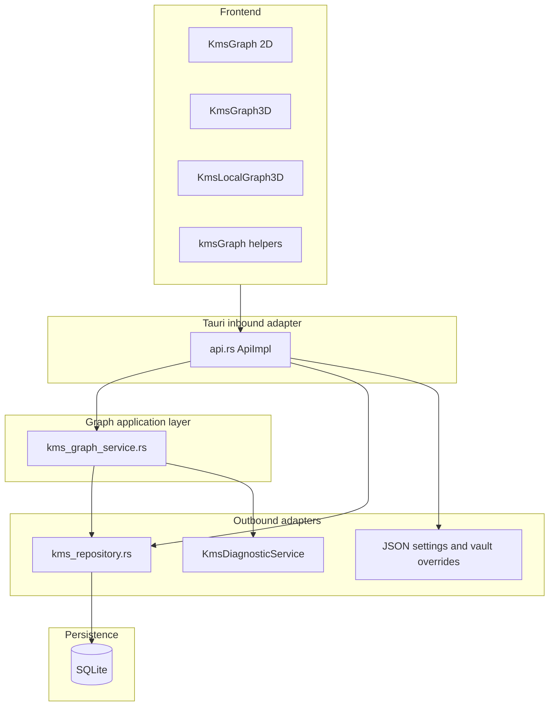

# Knowledge Graph: Comprehensive Audit, Alternatives, SWOT, and Implementation Roadmap

> Doc governance status: Canonical (technical baseline)
> Canonical companion tracker: `kms-notebook-capabilities-audit-and-implementation-plan-2026-04.md`
> Governance map: `kms-graph-doc-governance-map-2026-04.md`

**Document purpose:** Standalone audit of DigiCore KMS Knowledge Graph features as implemented in this repository (March 2026), with gaps versus robustness goals (errors, diagnostics, scale, maintainability), architectural alignment (hexagonal ports/adapters, configuration-first, SOLID, SRP), implementation alternatives with pros and cons, SWOT, explicit stakeholder decisions, and a phased plan.

**Primary code references:**

| Area | Location |
|------|----------|
| Graph domain logic | `digicore/tauri-app/src-tauri/src/kms_graph_service.rs` |
| IPC adapter, DTOs, settings merge | `digicore/tauri-app/src-tauri/src/api.rs` + `kms_graph_ipc.rs` (graph procedures) |
| SQLite access, embeddings | `digicore/tauri-app/src-tauri/src/kms_repository.rs` (`get_all_note_embeddings`, `get_note_embeddings_for_paths` for local graph hood) |
| Note embedding pipeline (O3) | `digicore/tauri-app/src-tauri/src/embedding_pipeline.rs`, `embedding_service.rs` |
| Shared KMS ports (hex) | `digicore/crates/digicore-kms-ports` (`LoadNoteEmbeddingsPort`, `EmbeddingGeneratorPort`, chunk config) |
| Effective graph + search/chunk params | `digicore/tauri-app/src-tauri/src/kms_graph_effective_params.rs` |
| D6 note re-embed migration | `digicore/tauri-app/src-tauri/src/kms_embedding_migrate.rs` |
| Diagnostics | `digicore/tauri-app/src-tauri/src/kms_diagnostic_service.rs` |
| 2D / 3D / local 3D UI | `KmsGraph.tsx`, `KmsGraph3D.tsx`, `KmsLocalGraph3D.tsx` under `tauri-app/src/components/kms/` |
| Shared TS helpers, paging, islands | `tauri-app/src/lib/kmsGraph*.ts` |
| Graph debug clipboard (client) | `tauri-app/src/lib/kmsGraphDebugClipboard.ts` |
| Graph exports (IPC) | `kms_export_wiki_links_json`, `kms_export_graph_graphml`, `kms_export_graph_dto_json` in `kms_graph_ipc.rs` |
| Recent graph builds ring (export) | `digicore/tauri-app/src-tauri/src/kms_graph_build_ring.rs` |
| Structured IPC errors (client) | `tauri-app/src/lib/ipcError.ts` |
| App state / persisted keys | `digicore-text-expander` `app_state.rs`, `ports/storage.rs` patterns; graph fields wired through `api.rs` |
| Configuration UI | `tauri-app/src/components/ConfigTab.tsx` |

**Related planning docs (do not duplicate; cross-check for drift):** `knowledge-graph-features-audit-and-implementation-plan.md`, `kms-knowledge-graph-and-local-graph-audit-2026-03.md`, `prd-kms-graph-paged-view-and-per-vault-overrides.md`, `kms_graph_3.0_roadmap.md`, `kms-graph-prd-progress.md`, `kms-graph-island-legend-followup-scope.md`, **`kms-embeddings-temporal-graph-semantic-search-hexagonal-plan-2026-03.md`** (authoritative **embedding + semantic search + seq 12 temporal** status log, checklist §11, and open follow-ups; **mirror of key items below §8.3**).

---

## 1. Executive summary

The Knowledge Graph is a **local-first wiki-link graph** stored in SQLite (`kms_notes`, `kms_links`) with an optional **semantic layer**: k-means on note embeddings, **AI beams** (high cross-cluster cosine similarity), **cluster labels** (medoid titles plus keyword fallback), and **undirected PageRank** for relative importance. The app exposes **global** graph payloads with optional **path-ordered pagination**, **local** neighborhood graphs via **incremental SQL-scoped BFS**, **shortest path** over undirected wiki links, and **note preview** RPCs. Settings are **configuration-first**: many tunables live on `AppState`, persist through the existing JSON storage adapter, support **per-vault overrides** merged in `effective_graph_build_params`, and surface in **Configurations and Settings**. Client-side **structured IPC errors** (`ipc_error` + `formatIpcOrRaw`) improve recoverability messaging.

**Strengths:** Working 2D/3D experiences, explicit module boundary (`kms_graph_service`), **undirected** dedup for local BFS (`local_neighborhood_edges` and incremental fetch share one edge per wiki link), DTO **warnings** for semantic skip conditions, configurable PageRank and beam budgets, auto-paging hooks, **Leiden** communities (optional flag) on wiki + semantic kNN graph, **materialized wiki PageRank** (MVP: DB column + fingerprint, lazy persist, optional background refresh after vault sync) with Config opt-out, growing test coverage (`kms_graph_service` unit tests including Leiden + BFS parity + paginated **`build_full_graph_from_notes_and_links`**, `kmsGraphHelpers.test.ts`), client **Copy debug info** and export **ring buffer** for support, **GraphML + wiki-links JSON + full graph DTO JSON** exports from KMS Health.

**Primary improvement themes:** (1) **Scale** - full-graph PageRank before paging; full link scan for shortest path until the **recorded** in-memory adjacency cache ships (section 7.1). (2) **Hexagonal purity** - the Tauri `api.rs` layer remains very large; graph orchestration is better than before but not yet a small "inbound adapter only" surface. (3) **Observability** - **Shipped (2026-03-29):** correlation IDs, **`kms_export_graph_diagnostics`**, client **Copy debug info** (JSON to clipboard), and server **`recent_graph_build_ring_tail`** on export (last graph builds without opening the graph tab). Deeper tracing remains optional. (4) **Contract stability** - TypeScript bindings must stay in sync with Rust DTOs (`bindings.ts` / regeneration workflow), including future **kNN edge kinds**. (5) **Path normalization** - ingest now canonicalizes vault-relative paths (`norm_vault_rel_path` in index sync); residual legacy rows may need re-index for perfect alignment.

**Recorded product direction (section 7.1):** link cache after index refresh; embedding **kNN as first-class edges**; k-means default + **kNN+Leiden** behind a flag (**default on** for smoke testing, with note that release defaults may differ); **WebWorker** for layout under load; **guided** per-vault overrides UI writing existing JSON. **PageRank:** under **auto-paging**, default **`page_subgraph`**; **vault-wide** centrality remains a first-class path for knowledge architects, ideally via **materialized global PageRank** at index time with subgraph retained for cold cache and predictable paged IPC (7.1 #7-9, 7.2.1). **Scale:** recorded **interactive support ceiling** and **default knob targets** in **7.2.2** (7.1 #10).

---

## 2. Current architecture (accurate to codebase)

**Directed vs undirected semantics** (documented in `kms_graph_service.rs`): stored wiki links are **directed**; local BFS, PageRank, and shortest-path treat the graph as **undirected** for traversal and centrality. AI beams are undirected pairs for visualization.

---

## 3. Feature inventory

### 3.1 Global graph (`kms_get_graph`)

- Optional pagination: `limit == 0` means full graph; else nodes sorted by absolute path, slice applied, edges and beams filtered to the page; `KmsGraphPaginationDto` returned.
- Semantic clustering and beams respect `semantic_max_notes` (vault-wide skip with warning, or per-page cap/warnings when paged).
- Embedding load failures: `KmsDiagnosticService::warn` plus DTO `warnings` string (user-visible degradation).
- `build_time_ms` and diagnostic summary log after build.
- Config: k-means, iterations, beam caps, pair-check budget, PageRank iterations/damping (global + per-vault overrides), auto-paging thresholds, visual prefs (bloom, hex grid, sprite label scales).

### 3.2 Local graph (`kms_get_local_graph`)

- Path normalization and vault membership checks in `api.rs`; `build_local_graph` in service.
- **Incremental** neighborhood: `local_neighborhood_edges_incremental` + `kms_repository::get_links_for_notes` (not a full-table link load for BFS expansion). **Undirected dedup:** each stored wiki link appears **once** in the returned edge list (canonical key `min(rel), max(rel)`), matching the reference `local_neighborhood_edges` walker.
- **Done (2026-03-30):** BFS returns visited paths; **`build_local_graph`** loads **minimal notes by path** (not a full-table note scan). Embeddings for the neighborhood come from **`get_note_embeddings_for_paths`** (scoped), not a full-vault embedding load.
- Local clustering on embeddings intersecting the neighborhood; embedding errors produce warnings (local path).
- No AI beams on local DTO (by design today).

### 3.3 Path and preview

- `kms_get_graph_shortest_path`: loads **all links** from DB, BFS on undirected adjacency, returns absolute paths for UI.
- `kms_get_note_graph_preview`: truncated content for hover/tooling (see `api.rs`).

### 3.4 UI and client libraries

- Force-directed 2D/3D, constellation backdrop, island/legend utilities, session paging (`kmsGraphPaging.ts`), `formatIpcOrRaw` for errors.
- **Copy debug info:** `kmsGraphDebugClipboard.ts` + toolbar actions on **KmsGraph**, **KmsGraph3D**, and **KmsLocalGraph3D** copy a **`kms_graph_client_debug_v1`** JSON payload (graph summary, paging, path tool, vault diag when loaded, structured IPC parse for errors).
- **KMS Health exports:** wiki links JSON (`kms_wiki_links_export_v1`), GraphML full build, and **full graph DTO JSON** (`kms_graph_dto_export_v1` envelope + `graph` object matching `kms_get_graph` / `KmsGraphDto`).

---

## 4. Detailed findings

### 4.1 Hexagonal architecture, SOLID, SRP

| Finding | Severity | Notes |
|---------|----------|-------|
| `kms_graph_service` centralizes graph algorithms | Positive | Aligns with application/service layer; module header states hexagonal intent. |
| `api.rs` remains large | Medium | Graph-related procedures and DTO mapping live in `kms_graph_ipc.rs` (submodule via `#[path]`); the rest of the TauRPC surface is still a large file. Further splits can follow the same pattern. |
| Repository holds data access only | Mostly good | Keep analytics out of `kms_repository` where possible; k-means already lives in `kms_graph_service`. |
| `node_type_and_folder` heuristic in one place | Low | Still convention-based (`/skills/`, image extensions); document as domain rule or move to a small `KmsNoteClassifier` if rules grow. |

### 4.2 Configuration-first and operability

| Finding | Severity | Notes |
|---------|----------|-------|
| Many `kms_graph_*` fields on `AppState` | Positive | Single source for UI and build params; clamps in Rust and UI. |
| Per-vault overrides JSON | Positive | `effective_graph_build_params` merges by vault key; invalid JSON surfaces IPC codes (`KMS_VAULT_OVERRIDES_*`). |
| Export/import bundle alignment | Medium | Ensure new keys always added to storage persistence and bundle groups together to avoid silent defaults on restore. |

### 4.3 Correctness and consistency

| Finding | Severity | Notes |
|---------|----------|-------|
| Full-graph PageRank **before** pagination | **High (performance)** | `build_full_graph` builds all nodes/edges, runs `undirected_pagerank` on the full set, then slices. Paged views still pay full-graph CPU/memory for centrality. |
| Shortest path loads all links | **High (performance)** | Every path query scans the full link table into memory. |
| Cluster map keys vs note paths | Medium | Embedding rows keyed by path must match `kms_notes.path` normalization; mismatches yield missing `cluster_id`. Consider canonical path helper shared with indexing. |
| Paged semantic clustering | Low (by design) | Warnings explain that clusters/beams are not comparable across pages; good UX honesty. |

### 4.4 Reliability, errors, and logging

| Finding | Severity | Notes |
|---------|----------|-------|
| Structured IPC errors | Positive | Codes in `ipcError.ts` with hints; Rust `ipc_error` JSON shape. |
| `spawn_blocking` for global graph | Positive | Avoids blocking async runtime; join errors mapped to `KMS_GRAPH_WORKER`. |
| Correlation / request IDs | **Shipped (MVP)** | **`request_id`** on `KmsGraphDto`, path, preview, diagnostics export; logged on graph builds. Optional: propagate same id through all nested adapter calls. |
| Frontend logging | Mixed | Some `console.log` in spatial components; prefer leveled, gated logger for production diagnostics. |
| Local graph note load | **Improved (2026-03-30)** | **`build_local_graph`** uses **`get_notes_minimal_by_paths`** for visited set; embeddings via **`get_note_embeddings_for_paths`**. Residual risk: very large neighborhood radius still scales with BFS depth x note row size. |

### 4.5 AI beams and clustering

| Finding | Severity | Notes |
|---------|----------|-------|
| Pairwise work bounded by `beam_max_pair_checks` | Positive | Predictable cost; warning when budget exhausted. |
| k-means quality / determinism | Low | Forgy init; no seed control in settings; reproducibility across runs may vary. |
| Alternative algorithms | Future | HDBSCAN, Leiden/Louvain on kNN graph could replace k-means for uneven cluster sizes (see alternatives). |

### 4.6 Testing and quality

| Finding | Severity | Notes |
|---------|----------|-------|
| Rust unit tests in `kms_graph_service.rs` | Positive | Shortest path, incremental vs full BFS parity, Leiden two-component, **`build_full_graph_leiden_wiki_two_components_no_db`**, pagination meta, materialized PR reuse, repo-backed smoke test. |
| Vitest for TS helpers | Positive | Extend for paging and island edge cases. |
| Integration tests (IPC + DB) | Gap | Few or none for full `kms_get_graph` against temp DB; valuable for regression. |

---

## 5. SWOT

| | |
|--|--|
| **Strengths** | Local-first privacy; single SQLite source of truth; configurable semantics; incremental local link fetch; structured errors; rich UI. |
| **Weaknesses** | Full-graph PageRank before paging; full link load for shortest path; large `api.rs`; TS/Rust DTO sync discipline; console logging inconsistency. |
| **Opportunities** | Incremental indexing hooks; cached graph snapshots; optional native graph index; better observability; semantic graph from embeddings (kNN edges). |
| **Threats** | Very large vaults causing UI freezes or OOM if settings are aggressive; user confusion when paged clusters differ from mental model of "one global topic map". |

---

## 6. Alternative approaches (pros / cons)

### 6.1 Centrality: compute PageRank only for returned page vs full vault

| Approach | Pros | Cons |
|----------|------|------|
| **A. Current:** full graph PageRank, then slice | Correct global centrality scores on every node before filter | Expensive for large vaults when only a page is shown |
| **B.** PageRank on page-induced subgraph only | Fast for paging | Scores not comparable to global importance; misleading if shown as "global" |
| **C.** Precompute / cache PageRank on index update | Fast reads; consistent global scores | Storage and invalidation complexity; needs incremental update strategy |
| **D.** Drop centrality for paged mode or show rank only in full mode | Simple | Feature regression unless communicated clearly |

**Recommendation:** Plan **C** long-term with a materialized column or side table. **Recorded (section 7.1):** implement **D** with **`page_subgraph` as the effective default when auto-paging is active**; **materialized global PR** plus subgraph **both** stay in the long-term design (architects need vault-wide scores without per-request full recompute).

### 6.2 Shortest path: full scan vs indexed adjacency

| Approach | Pros | Cons |
|----------|------|------|
| **A. Current:** load all `(source,target)` rows | Simple, always correct | O(links) memory and CPU per request |
| **B.** In-memory adjacency cache invalidated on index sync | Fast repeated queries | Memory; correctness tied to sync events |
| **C.** Adjacency list table maintained by triggers or batch job | Fast BFS with bounded IO | Migration and write-path complexity |

**Decision (recorded):** **B** - in-memory adjacency after first load, with explicit invalidation on vault index refresh / `sync_note_index` completion (see Phase 1).

### 6.3 Semantic layer: k-means vs graph/community detection

| Approach | Pros | Cons |
|----------|------|------|
| **k-means (current)** | Simple, fast enough at moderate n | Spherical cluster assumption; sensitive to k |
| **HDBSCAN / spectral** | Better uneven clusters | Heavier; more tuning |
| **kNN graph + Leiden** | Graph-native; good for visualization; aligns topic islands with structure | Needs kNN index; more code; extra dependencies for Leiden |

**Recommendation:** Keep **k-means as the default** clustering path for production stability. Prototype **kNN graph + Leiden** behind a dedicated feature flag (configuration-first: `AppState` + persist + Config tab). **Default for that flag:** **enabled** so CI and developers can smoke-test the Leiden path continuously; product may later ship with default **disabled** for end users once tuning is complete, without removing the smoke-test preset from dev/staging profiles if desired.

**Decision (recorded):** Semantic roadmap prioritizes **embedding kNN edges as first-class graph links** in the DTO and UI (distinct edge kind / styling, caps per node, respects existing `semantic_max_notes` and performance budgets). kNN+Leiden remains the optional community-detection layer on top of that kNN semantic graph where the flag applies.

### 6.4 Hexagonal placement: crate split vs in-app module

| Approach | Pros | Cons |
|----------|------|------|
| **A. Current:** `kms_graph_service` inside tauri crate | Low friction; shared repo access | Harder to reuse from other binaries |
| **B.** `digicore-kms-graph` crate with ports | Clean ports: `NoteStore`, `LinkStore`, `EmbeddingStore` | Migration effort; trait plumbing |

**Recommendation:** **B** when a second adapter (CLI, headless job) needs the same logic; until then, enforce boundaries inside the tauri crate with explicit traits in a `kms_graph_ports.rs` file as a stepping stone.

### 6.5 Layout engine: D3 / R3F vs dedicated graph engine

| Approach | Pros | Cons |
|----------|------|------|
| **Current (force simulation in JS)** | Flexible; no native deps | CPU on main thread for huge graphs |
| **WebWorker layout** | Keeps UI responsive; preferred upgrade path | Serialization cost for positions/graph payload |
| **GPU / graph layout library** | Scales visually | Integration cost; only consider after WebWorker path is exhausted |

**Recommendation:** Prefer **WebWorker**-hosted force simulation (or incremental layout steps posted from a worker) when node count exceeds a configurable threshold. Treat GPU layout as a later option only if profiling shows worker throughput is still insufficient.

---

## 7. Key decisions

### 7.1 Recorded stakeholder decisions (2026-03-28)

| # | Topic | Decision |
|---|--------|----------|
| 2 | Shortest path budget | **In-memory link adjacency cache** after vault index refresh; invalidate on sync. Faster repeated path queries; higher RAM use acceptable for desktop target. |
| 3 | Semantic roadmap | **Embedding kNN edges as first-class graph links** (DTO edge kind, UI styling, tunable caps). Works alongside wiki links; k-means remains default clustering; kNN+Leiden optional behind flag (see 6.3). |
| 4 | Observability | **Yes:** **correlation IDs** on graph IPC for support bundles (propagate through adapter logs and optional client debug copy). **Yes:** optional **verbose graph diagnostics file export** (structured snapshot: build params, timings, warning list, request id, vault hash or path redaction policy). |
| 6 | Per-vault overrides UX | **Guided UI** (fields / toggles) that **writes the same JSON** structure as today under `kms_graph_vault_overrides` / `effective_graph_build_params`; advanced users may still view or edit raw JSON if exposed as secondary. |
| 7 | Paged centrality default | **No** backward-compatible requirement to keep `full_vault` as default for all users. When **auto-paging** is active (UI in paged graph mode), the product **defaults to `page_subgraph`** PageRank unless the user chooses otherwise. |
| 8 | Global ranking persona | **Global** vault-wide ranking remains a **must-have** for some personas (e.g. **knowledge architects**). UX and implementation must expose a clear path to **vault-wide** centrality, not only page-local scores. |
| 9 | Materialized PR vs subgraph (long-term) | **Keep both** (see 7.2.1 recommendation below). Materialized global PageRank at index time serves architects and amortizes cost; subgraph remains for predictable paged IPC, cache-miss, and cold-start paths. |
| 10 | Vault scale / interactive graph | **Recorded scale policy** (section 7.2.2): reference hardware, tier ceilings, p95 targets, and **recommended shipped defaults** for `semantic_max_notes`, auto-paging, and warn threshold. Aligns with paging + subgraph defaults, materialized PR roadmap, kNN edge density risk, and WebWorker layout. |

### 7.2 Supporting context and recorded scale policy

Subsection **7.2.1** (centrality) and **7.2.2** (scale) below retain background tables for engineering; **7.2.2** now includes the **recorded scale policy** subsection.

---

#### 7.2.1 Paged graph centrality (policy recorded; implementation follows Phase 1b + Phase 4)

**What the product does today (implementation fact):** In `build_full_graph`, the service builds the **full** node list and **full** wiki-link edge list, runs **undirected PageRank** over **all** nodes and edges, **then** applies path-ordered pagination (slice of nodes, filter edges to the page). So when the UI is in **paged** mode, the user still pays **full-vault** PageRank cost every refresh. Node size / emphasis in the force view uses `link_centrality` from that global computation.

**Why it matters:** PageRank is roughly **O(iterations x (nodes + edges))** per build with fixed iteration count (`kms_graph_pagerank_iterations` globally, `kms_graph_pagerank_local_iterations` for local graph). For vaults with tens of thousands of notes and dense links, paged mode was meant to cap **payload and rendering** size, not **server-side** graph analytics cost. That mismatch is the core tension.

**Options to decide among (you may combine with a user-visible setting, as sketched in Phase 1b):**

| Option | Behavior | Pros | Cons |
|--------|----------|------|------|
| **A. Global PageRank only (status quo)** | Always compute centrality on the full wiki graph, then slice for display. | Scores are **comparable** across pages and match "importance in the whole vault." Same meaning as non-paged mode. | **Highest CPU** when paging; large vaults feel slow even when showing 500 nodes. |
| **B. Subgraph PageRank when paged** | After slicing to the page (and edges induced by those nodes), run PageRank **only** on that subgraph. | **Much cheaper** when `returned_nodes << total_nodes`. Predictable cost tied to page size. | Scores are **local to the page**, not global. A hub on another page can look "small" on this page. **Misleading** if the UI implies global importance without relabeling. |
| **C. Off when paged** | Skip PageRank when `pagination` is active; set `link_centrality` to a neutral value or degree-based proxy on the page only. | Cheap; simple story: "centrality only in full graph mode." | Feature **regression** for paged users unless size/opacity uses another cue (e.g. degree on page). |
| **D. Hybrid (recommended engineering path)** | Expose **`pagerank_scope`**: `full_vault`, `page_subgraph`, `off`. Persist in `AppState`, Knowledge Graph settings, optional per-vault override. **Product rule:** when the graph is in **auto-paged** mode, **default effective scope is `page_subgraph`** (not `full_vault`). | Balances **cost** for typical large-vault browsing with an explicit path to **global** meaning for architects. | More settings surface; must **label** the UI clearly (see below). |

**Recorded policy answers (stakeholder, 2026-03-29):**

1. **Backward-compatible default:** Not required. The product **may and should** default to **`page_subgraph`** when auto-paging is in effect.
2. **Global ranking:** **Must remain available** for personas such as **knowledge architects** (not optional long-term).
3. **Materialized global PageRank vs subgraph long-term:** **Recommendation (approved framing): keep both.** They are complementary given your other decisions (link cache, correlation IDs, embedding/kNN roadmap, scale pressure):
   - **Materialized / cached global PageRank (Phase 4, index-time)** should be the **primary** way to deliver **true vault-wide**, comparable `link_centrality` **without** paying full in-request PageRank on every paged refresh. It directly supports knowledge architects and aligns with **configuration-first** and **robust** indexing hooks (invalidate/recompute on sync completion).
   - **`page_subgraph`** should **remain** as the **default under auto-paging** for **predictable IPC latency**, and as the **fallback** when materialized scores are **missing, stale, or invalidated** (e.g. mid-index, new vault, migration not yet applied, or user explicitly wants a cheap local view).
   - **Do not** plan for materialized PR to **fully replace** subgraph mode: you still need a defined behavior when the cache is cold or disabled. **Do not** rely on subgraph alone for architects at scale: without materialization, "global" would imply repeated expensive full-graph recomputation.

**Suggested product surface (for implementation backlog):**

- **Default:** `page_subgraph` whenever the session/UI is using **paged** graph fetches (including when auto-paging turned the view paged).
- **Architect / power path:** Toggle or mode e.g. **"Vault-wide centrality"** that prefers **materialized** global scores when present; if absent, either trigger background recompute, run on-demand **full_vault** PageRank with a **warning** / progress, or show a clear "scores updating" state (exact choice is UX + perf spike).
- Toolbar / legend copy must distinguish **importance on this page** vs **importance across vault** (see below).

**UX and labeling (required):**

- Legend or tooltip on node size / glow: e.g. "Importance **on this page**" vs "Importance **across vault**."
- If semantic clustering is paged, you already warn that clusters are not comparable across pages; **centrality** should use the same honesty when scope is local.
- Consider a small badge in the graph toolbar when paged: "PageRank: full vault" / "PageRank: this page only" / "PageRank: off" / "PageRank: vault-wide (cached)" when materialized data is served.

**Release / doc note when shipping:** Changelog entry: default PageRank scope under auto-paging is **page-local**; how to opt into **vault-wide** (cached or computed).

---

#### 7.2.2 Vault scale target ("interactive graph")

**What to define:** An **official maximum supported note count** (or tiered table) for the **global** Knowledge Graph experience where the product still claims **interactive** behavior: graph open, pan/zoom, path find, reasonable time-to-first-frame after IPC returns, without routine OOM on reference hardware.

**"Interactive" should be defined with at least one of:** target **p95** `build_time_ms` for `kms_get_graph` (full or paged), max **RSS** for the desktop process during graph build, or min **FPS** / frame budget for the 3D force simulation. Without that, "10k notes" is ambiguous (sparse links vs dense, embeddings on/off, machine specs).

**How this target drives configuration defaults (today and planned):**

| Knob | Role relative to scale |
|------|-------------------------|
| `kms_graph_semantic_max_notes` | Caps embedding-backed work (k-means, beams). Above cap, semantics are skipped with a DTO warning. **Should scale with** your chosen max vault size or be a fraction of it. |
| `kms_graph_auto_paging_enabled` + `kms_graph_auto_paging_note_threshold` | Switches UI to paged fetches when indexed count is high. **Threshold should sit below** the pain point for full payload + layout on target hardware. |
| `kms_graph_warn_note_threshold` | Soft warning only; **marketing / support** can align copy with "above this, use paging or expect slowness." |
| Future **materialized PageRank** / link cache | **Amortizes** cost across opens; invalidation policy ties to index sync. Target vault size sets how aggressive precompute must be. |

**Reference tier table (for engineering and support copy):**

| Tier | Indexed notes (indicative) | Product stance | Example default posture |
|------|----------------------------|----------------|-------------------------|
| S | 0 - 2,000 | Comfortable full-graph exploration | Semantics on within cap; paging optional; user may disable auto-paging |
| M | 2,001 - 6,000 | Interactive; prefer paged global graph | **Auto-paging on** at policy threshold; **page_subgraph** default when paged (7.1 #7) |
| L | 6,001 - **12,000** | **Supported interactive ceiling** (see policy below) | Paging + semantic cap + subgraph PR default; materialized global PR when shipped (7.1 #9) |
| XL | 12,001 - 30,000 | **Best effort** (degraded, not unsupported) | Strong caps on kNN edges per node; WebWorker layout; semantics often skipped or capped; diagnostics export for support (7.1 #4) |
| XXL | 30,001+ | **Analysis / power user** | No interactive guarantee; document vault size in UX; rely on paging, optional features off |

**Risks of choosing a target:**

- **Too high (e.g. "we support 100k notes interactive"):** Support burden, bad reviews, impossible defaults without major engineering (precompute, worker layout, DB-side graph).
- **Too low (e.g. 2k max):** Power users with large wikis feel capped; competitors advertise higher limits.

---

##### Recorded scale policy (stakeholder-aligned recommendations, 2026-03-29)

This policy is **consistent with** decisions **7.1 #2-10**: link adjacency cache (path queries), correlation IDs and diagnostics export (support at scale), **kNN as first-class edges** (adds visual and compute density - policy stays **conservative** on ceilings until kNN caps are profiled), **Leiden** flag (optional layer - does not raise the interactive ceiling by itself), **page_subgraph when auto-paging**, **materialized global PageRank** as the long-term way to serve architects without per-request full recompute, and **WebWorker** layout when on-screen or returned node counts exceed a threshold.

**Reference hardware (support and marketing alignment):**

- **PC:** Windows 11 x64, **16 GB RAM**, mid-range mobile or desktop CPU (circa 4P+8E cores or equivalent), SSD.
- **Apple:** Apple Silicon with **16 GB** unified memory, current minus two generations acceptable.
- Policy assumes **integrated or mid discrete GPU** sufficient for 3D graph chrome; heavy bloom optional.

**Definition of "interactive" (measurable):**

- **Backend:** For a **paged** `kms_get_graph` at the **supported interactive ceiling** (12k indexed notes), target **p95 `build_time_ms` <= 5,000 ms** on reference hardware, with **effective** `pagerank_scope` = `page_subgraph` when auto-paging is on, and with `semantic_max_notes` at the policy default (embedding work may skip vault-wide semantics above that cap - existing DTO warning behavior).
- **Client:** Target **p95 time to first useful frame** (graph visible, input accepted) **<= 8 s** after navigation to graph tab at the same ceiling, assuming WebWorker layout is used when **returned node count** or **total indexed count** exceeds **`kms_graph_webworker_layout_threshold`** (to be added with Phase 4 / 6.5; recommend initial value **800** returned nodes or **6,000** indexed notes, whichever comes first - tune after profiling).
- **Memory:** Avoid **routine** OOM on 16 GB with a single graph session; if kNN edges ship, **per-node kNN cap** must be enforced so edge cardinality stays bounded (recommend documenting a default cap in config, e.g. **8-16** neighbors per note, separate follow-up).

**Official numbers (recorded):**

| Policy item | Value | Rationale |
|-------------|-------|-----------|
| **Supported interactive ceiling** | **12,000** indexed notes | Balances desktop KMS use, paging + subgraph defaults, and future kNN density; revise after kNN + materialized PR benchmarks. |
| **Extended (best effort)** | **12,001 - 30,000** | Supported install, **degraded** experience; copy and support scripts should say "may be slow" and point to diagnostics export. |
| **Above 30,000** | **No interactive guarantee** | Power / archival vaults; features remain best effort; architects rely on exports and local graph. |

**Recommended shipped defaults (configuration-first - align `AppState` + Config tab + bundle export):**

| Key | Recommended default | Rationale |
|-----|---------------------|-----------|
| `kms_graph_auto_paging_enabled` | **true** | Matches **predictable IPC** under paging + **page_subgraph** default (7.1 #7); users who want always-full graph can turn off. |
| `kms_graph_auto_paging_note_threshold` | **2,000** | Starts paged fetches before tier M upper bound; keeps payloads and layout work bounded. |
| `kms_graph_warn_note_threshold` | **1,500** | Soft warning **before** auto-paging engages at 2k; aligns with existing "large vault" messaging. |
| `kms_graph_semantic_max_notes` | **2,500** | **Keep** current default: one embedding-heavy pass cap; vaults larger than cap already get skip + DTO warning; works with 12k ceiling if paging limits nodes per request. |

**Embeddings / semantics at scale:** Full-vault k-means + beams for every note above **2,500** is **not** part of the interactive promise; degradation with warnings is **acceptable** and already implemented. When **kNN edges** ship, treat **semantic edge count** as part of perf budgets; policy **does not** require raising `semantic_max_notes` until profiling proves headroom.

**Materialized PageRank and link cache:** At and above tier L, **materialized global PR** (Phase 4) is the intended way to meet **architect** expectations without violating paged **page_subgraph** defaults for casual browsing. **Link cache** improves pathfinding latency but does not change the **note count** ceiling by itself.

**Review trigger:** Revisit this subsection after (1) kNN edge defaults land, (2) first WebWorker layout rollout, and (3) materialized PageRank MVP - update ceiling or defaults if p95 targets are met with margin.

---

## 8. Phased implementation plan

Phases are ordered for dependency and risk. Each phase should include: code changes, config keys (if any), tests, and diagnostic log lines (level + message pattern).

### Phase 0 - Hardening and honesty (short)

- **Done (code):** `AppState::default` and TS **`kmsGraphPaging.ts`** policy constants match 7.2.2 (`auto_paging` **on**, threshold **2,000**, warn **1,500**). **Done (UI):** Knowledge Graph > PageRank section now includes **12k interactive ceiling** guidance and scope vs full-vault cost copy (2026-03-29).
- **Done (partial):** `norm_vault_rel_path` + fallback cluster lookup on full-graph nodes to reduce `cluster_id` misses when embedding keys differ by slashes/leading path.
- Document in UI help: what paged clustering warnings mean (existing DTO warnings; optional extra inline help later).
- **Done (2026-03-29):** **Graph build safety net:** `build_full_graph_from_notes_and_links` in **`kms_graph_service.rs`** + unit test **`build_full_graph_from_notes_respects_pagination_meta`** (synthetic notes/links, pagination metadata and edge filtering). Full **temp-vault + IPC** harness remains an optional follow-up if product wants end-to-end DB tests in CI.
- **Done (2026-03-29):** **Path keys at ingest:** **`sync_note_index_internal`** and **`sync_vault_files_to_db_internal`** use **`norm_vault_rel_path`** for note rows, resolved wiki targets, embedding **`entity_id`**, and vault scan / DB path map keys (aligns with runtime graph and embeddings; legacy DB rows may need re-index).
- **Done (2026-03-29):** **`kmsGraphLog`** (`tauri-app/src/lib/kmsGraphLog.ts`): debug/warn gated by **`import.meta.env.DEV`** or **`localStorage.kms_graph_debug_log === "1"`**; **`kmsGraphLog.error`** always logs. **`KmsGraph`**, **`KmsGraph3D`**, **`KmsLocalGraph3D`** use it; **Kms Health** fetch errors use **`kmsGraphLog.error`**.

### Phase 1 - Performance foundations

- **1a. Done (2026-03-29):** **`kms_link_adjacency_cache`**: in-process cache of `get_all_links` rows; **`invalidate_kms_link_adjacency_cache`** after **`sync_note_index_internal`**; graph build and shortest-path use **`get_all_links_cached`** (hit/miss logging). Remaining: invalidate on any other bulk link mutators if added later.
- **1b. Done (2026-03-29):** **`kms_graph_pagerank_scope`** on `AppState` (`auto` | `full_vault` | `page_subgraph` | `off`); **`auto`** = paged request uses **page subgraph** PageRank after slice, unpaged uses full vault; persisted + **Config tab** + **vault overrides** + settings bundle. **`build_full_graph`** logs resolved scope at info. Remaining: explicit `KmsDiagnosticService` line if desired; materialized PR in Phase 4.
- **1c. Done (2026-03-29):** **`get_notes_minimal_by_paths`** + local graph BFS returns visited rel list; **`build_local_graph`** loads notes by path instead of full-table scan.

### Phase 2 - Hexagonal cleanup (incremental)

- **Done (2026-03-30):** Workspace crate **`digicore-kms-ports`** with **`LoadNotesMinimalPort`**, **`LoadWikiLinksPort`**, **`LoadNoteEmbeddingsPort`** (+ **`load_note_embeddings_for_paths`**, embedding O3 types); Tauri **`kms_graph_ports.rs`** adapters; **`build_full_graph_with_ports`** / **`build_local_graph`** wired through the port.
- Split graph-related IPC handlers into a submodule file included from `api.rs` to shrink cognitive load (no behavior change). **Done:** graph bodies in **`kms_graph_ipc.rs`** (`#[path]` from `api.rs`).
- **Per-vault overrides (decision 7.1 #6):** **Done** in Vault settings modal for graph + search floor + embedding chunk keys; raw JSON remains for power users.

### Phase 3 - Observability and support (decision 7.1 #4)

- **Done (2026-03-29):** Server **`request_id`** on **`KmsGraphDto`**, **`KmsGraphPathDto`**, **`KmsNoteGraphPreviewDto`**. **`kms_get_graph_shortest_path`** and **`kms_get_note_graph_preview`**: **`log::info!`** + **`KmsDiagnosticService::debug`** with id. **`KmsEdgeDto.kind`** (default **`wiki`**) for Phase 4 edge kinds.
- **Done (2026-03-29):** **`kms_export_graph_diagnostics(path)`** IPC: pretty JSON with **`export_request_id`**, **`vault_fingerprint_hex16`** (SHA-256 prefix of vault path, not full path), **`kms_diag_summary`**, **`effective_graph_build_params`** (merged vault overrides), **`graph_related_app_state`** flags, tail of **`recent_expansion_diagnostics`**. **KMS Health** tab: **Export graph diagnostics** button (save dialog).
- **Done (2026-03-29):** **`recent_graph_build_ring_tail`** on the same export payload (**`kms_graph_diagnostics_v1`**): in-process FIFO ring (**`kms_graph_build_ring.rs`**, 32 entries) filled on successful **`kms_get_graph`** / **`kms_get_local_graph`** so support sees recent **`build_time_ms`**, counts, **`request_id`**, and pagination without the user opening the graph tab.
- **Done (2026-03-29):** User-facing **Copy debug info**: **`kmsGraphDebugClipboard.ts`**; clipboard JSON **`kms_graph_client_debug_v1`** from **KmsGraph** (2D), **KmsGraph3D**, and **KmsLocalGraph3D** (graph summary, paging, path tool, vault diag, IPC error structure).
- **Remaining (optional):** inline help for paged clustering warnings; deeper export fields (e.g. full DTO warning text in ring entries) if support asks.

### Phase 4 - Advanced features (ordered by recorded roadmap)

- **Embedding kNN edges as first-class links** (decision 7.1 #3): **Done** - `KmsEdgeDto.kind` (`wiki` / `semantic_knn`), caps, threshold, Config + vault overrides, 2D/3D/local legend toggles, tests.
- **kNN + Leiden prototype:** **Done (MVP)** - `single-clustering` Leiden on undirected wiki + `semantic_knn` graph; `kms_graph_enable_leiden_communities` end-to-end; k-means skipped when Leiden + semantic clustering; wiki-only and failure **warnings**; k-means fallback on Leiden error; local graph parity; unit tests (Leiden split, full-graph Leiden smoke). Upstream crate documents Leiden as WIP; seed/perf tuning optional.
- **Materialized global PageRank** column (or side table) updated on index sync (batch recompute or incremental approximation - research spike first). **Invalidate** with link cache / index hooks (decision 7.1). Feeds **vault-wide** centrality for paged + architect modes; pair with **`page_subgraph`** default under auto-paging (section 7.2.1). **Done (MVP, 2026-03-28):** `wiki_pagerank` + fingerprint reuse; lazy persist on miss; **background** full-vault materialize after bulk vault sync (non-blocking); **`kms-wiki-pagerank-ready`** event + graph refetch + toast; opt-out via **`kms_graph_background_wiki_pagerank_enabled`** in Config (default on). **Done (2026-03-30 tail):** debounced background materialize when global pagerank iterations/damping/scope change via **`update_config`** (see hex plan Track C / D7). **Remaining (optional):** further PR-on-settings edge cases if product asks.
- **Temporal graph (seq 12 MVP):** **Done (2026-03-30)** per **`kms-embeddings-...-plan-2026-03.md`** §11: **Option A** (optional `last_modified` window on graph RPCs + config defaults), **Option B** (edge recency on `KmsEdgeDto`), **separate flags**; **PageRank ignores** time filter (D3). **Future:** Option C (versioned snapshots / valid-from edges); extra tests / UX polish.
- **Graph export:** **Done** for wiki links JSON (`kms_export_wiki_links_json`), **GraphML** (`kms_export_graph_graphml`, all edge kinds in build), and **full graph DTO JSON** (`kms_export_graph_dto_json`, schema `kms_graph_dto_export_v1`, same shape as `kms_get_graph`). KMS Health buttons for all three.
- **Layout:** **2D** force simulation runs in a **WebWorker** above `kms_graph_webworker_layout_threshold` (section 6.5). **3D** WebWorker is optional / future.

### 8.1 Prioritized execution queue (progress tracker)

**Purpose:** Single ordered backlog after the v1.7 hardening/observability drop. **Do work top-to-bottom** unless a dependency blocks (e.g. materialized PR may inform WebWorker thresholds). **Maintenance:** when a row ships, set **Status** to **Done**, add **Closed** date in **Notes**, and bump **Document control** (section 10) for major releases. Optional small items at the bottom may be batched.

**Cursor TODOs:** Mirror this queue (same order) and **section 8.2** next-actions in the IDE task list for day-to-day tracking.

| Seq | Work item | Phase | Status | Notes |
|-----|-----------|-------|--------|-------|
| 1 | **Temp-vault integration test** — temp SQLite + `ensure_kms_notes_links_schema`, seed notes/links, `build_full_graph` + `shortest_path_undirected_wiki` on real rows (`repo_backed_full_graph_pagination_and_shortest_path` in `kms_graph_service` tests). Full **TauRPC** IPC harness still optional. | 0 / QA | **Done** | Closed 2026-03-29 |
| 2 | **Extract graph IPC** — `kms_graph_ipc.rs` holds graph RPC bodies + DTO mappers; `api.rs` keeps TauRPC trait + thin `kms_graph_ipc::...` delegations (submodule via `#[path]`; no `api/` directory). `kms_graph_effective_params.rs` unchanged. | 2 | **Done** | Closed 2026-03-28 |
| 3 | **WebWorker layout** — **2D shipped:** force simulation in a worker above `kms_graph_webworker_layout_threshold` + Config tuning. **3D optional** / not required for parity (same threshold can gate 3D later). | 4 / 6.5 | **Done (2D)** | 3D = optional follow-up |
| 4 | **Materialized global PageRank MVP** — persist scores at index/sync; read in `build_full_graph` for vault-wide scope; invalidate with link/index hooks | 4 | **Done (2026-03-28)** | **Shipped:** `kms_notes.wiki_pagerank` + `kms_graph_meta` link fingerprint; full-vault PR path reuses scores when fingerprint matches; recompute + persist on miss; fingerprint cleared with link adjacency cache invalidation. **Tail shipped:** background materialize after **`sync_vault_files_to_db_internal`** (skipped when `pagerank_scope` is off or effective **`kms_graph_background_wiki_pagerank_enabled`** is false after global + **vault overrides** merge); **`kms-wiki-pagerank-ready`** event; client toast + graph refetch; Config + **Vault Settings** graph overrides. **Optional later:** invalidate/recompute when global PR iteration defaults change without a sync. |
| 5 | **Guided per-vault graph overrides UI** — Vault settings modal graph section (toggles + numeric fields + PageRank scope) already ships; raw JSON path remains for power users. | 2 | **Done** | `VaultSettingsModal.tsx` |
| 6 | **kNN edges as first-class** — DTO edge `kind`, caps, threshold, distinct UI styling; perf budget per section 7.2.2 | 4 | **Done** | Closed 2026-03-29 (Rust + Config + vault overrides + graph 2D/3D/local legend toggles) |
| 7 | **UI help: paged clustering warnings** — inline copy when paged + graph notices (2D + 3D) | 0 | **Done** | Closed 2026-03-29 |
| 8 | **Diagnostics ring enrichment** — `warnings_tail` on ring entries (trimmed, max 5 x 220 chars) | 3 | **Done** | Closed 2026-03-29 |
| 9 | **Link adjacency cache invalidation audit** — invalidate after `KmsService` delete/rename/move, `kms_delete_folder`, `sync_vault` stale cleanup, `kms_repair_database` | 1 | **Done** | Closed 2026-03-29 |
| 10 | **`kms_graph_ports` traits** — `LoadNotesMinimalPort` + `LoadWikiLinksPort`; `KmsRepositoryGraphAdapter` + `WikiLinkAdjacencyCacheAdapter`; `build_full_graph_with_ports` + empty mock test. Embeddings port **remaining** for full hexagonal purity. | 2 | **Done** | Closed 2026-03-28 |
| 11 | **Leiden layer prototype** — `single-clustering` Leiden on undirected wiki + `semantic_knn` edges; skips k-means when flag on; user warnings (wiki-only, failures); k-means fallback on error; incremental/full BFS undirected dedup aligned; tests: Leiden split + `build_full_graph_leiden_wiki_two_components_no_db` | 4 | **Done (MVP)** | Crate docs: Leiden WIP; optional seed/perf tuning |
| 12 | **Temporal graph** — client timeline filter exists; **server** edge weighting / window API not built | 4 | Not started | Schema/derived attrs; **next large Phase 4 feature** after export/PR tail |
| 13 | **Graph export** — Wiki links JSON + GraphML + **full graph DTO JSON** (`kms_graph_dto_export_v1`, KMS Health) | 4 | **Done** | Closed 2026-03-28 |
| 14 | **Optional:** `KmsDiagnosticService` line when PageRank scope resolves | 1 | **Done** | `build_full_graph` info line |

### 8.2 Prioritized next actions (after seq 11 / 12 / 13 closure)

Work **top-down** unless blocked. This list is the default backlog until the table gains new rows.

| Priority | Focus | Rationale |
|----------|--------|-----------|
| **P1** | **Seq 4 tail** - **Done:** background wiki PageRank after bulk vault sync; **Done (2026-03-30):** debounced PR-on-settings when iterations/damping/scope change. **Optional:** further invalidation edge cases | Materialized PR story for architects |
| **P2** | **Embedding / search hardening** - **Done (2026-03-30 tail):** text query **384**-dim guard; port **`load_note_embeddings_for_paths`**; **`kms_search_default_mode` / limit** end-to-end. **Remaining:** stored **`embedding_model_version`** / dimension column; auto re-embed on chunk change | Safer model switches; cleaner hex boundary |
| **P3** | **Temporal Option C** or **polish** - versioned / "as of" graph if product prioritizes; else tests + toolbar copy for time filter | Seq 12 MVP shipped; next increment is product-led |
| **P4** | **3D WebWorker** layout (optional parity with 2D) | Section 6.5; profile after P2 |
| **P5** | **Leiden** - expose seed in config if product wants reproducibility; profile `single-clustering` on 12k vault | Polish; upstream crate WIP disclaimer stays |

### 8.3 Embeddings, semantic search, and seq 12 (mirror of companion doc)

**Source of truth for detail:** `kms-embeddings-temporal-graph-semantic-search-hexagonal-plan-2026-03.md` (§2 flow, §11 checklist, §12 log, open follow-ups).

| Theme | Status (2026-03-30) |
|-------|---------------------|
| **O3 pipeline** | **Shipped:** normalize, chunk mean-pool, ports in **`digicore-kms-ports`**, note sync + query path |
| **Multi-model fastembed** | **Shipped:** per **`kms_embedding_model_id`** (`EmbeddingModel::from_str`) |
| **D5 search floor** | **Shipped:** global + per-vault **`kms_search_min_similarity`** |
| **D6 migrate** | **Shipped:** background job + events + Config log / re-embed button |
| **D7 PR on settings** | **Shipped:** debounced wiki PageRank materialize on pagerank-affecting config changes |
| **D8 Config** | **Shipped:** KMS Search & embeddings sibling area |
| **Search diagnostics** | **Shipped:** optional via **`kms_search_include_embedding_diagnostics`**; **`SearchResultDto`** **Option** fields when off |
| **Local graph embeddings** | **Shipped:** **`get_note_embeddings_for_paths`** (scoped) |
| **Seq 12 temporal** | **Shipped (MVP):** A + B + IPC + flags; **not** Option C |
| **Open (embedding track)** | Version/dimension guard; port trait scoped load; default search mode/limit keys; auto re-embed on chunk-only change; richer D6 UX |

---

## 9. Non-functional requirements checklist (ongoing)

- **Robustness:** All graph RPCs return `Result` with structured errors; avoid panics in graph build (use `map_err` and warnings).
- **Configuration-first:** New tunables added to `AppState`, persistence, `ConfigUpdateDto`, `ConfigTab`, clamps, and bundle export/import.
- **SRP:** New behavior in `kms_graph_service` or new single-purpose modules; avoid growing unrelated `api.rs` helpers.
- **Logging:** Use `log` crate levels; user-visible issues also in DTO `warnings` where degradation occurs.
- **Windows:** Avoid problematic Unicode in source if team policy requires ASCII-only files for certain tools; prefer UTF-8 with BOM awareness in editors for docs.

---

## 10. Document control

| Version | Date | Summary |
|---------|------|---------|
| 1.0 | 2026-03-28 | Initial comprehensive audit and roadmap |
| 1.1 | 2026-03-28 | Recorded decisions: link cache, kNN first-class edges, observability, guided vault overrides; Leiden flag smoke-test default; WebWorker layout preference |
| 1.2 | 2026-03-29 | Expanded section 7.2: paged PageRank decision framework; vault scale target tiers and default-driving knobs |
| 1.3 | 2026-03-29 | Recorded policy 7.1 #7-9: auto-paging defaults to page_subgraph; global centrality for architects; materialized PR + subgraph both long-term; Phase 1b/4 text aligned |
| 1.4 | 2026-03-29 | Section 7.2.2: recorded scale policy (7.1 #10) - tiers, reference HW, p95 targets, ceilings, recommended AppState defaults |
| 1.5 | 2026-03-29 | Phase 1a-1c + 1b `pagerank_scope` shipped; Phase 0 partial (12k UI help, cluster path norm); Phase 3 partial (`request_id`, edge `kind`); doc status rows updated |
| 1.6 | 2026-03-29 | Phase 0: `kmsGraphLog` + graph component log cleanup; Phase 3: `request_id` + logging on shortest-path and note preview; `kms_export_graph_diagnostics` + Health UI; roadmap Phase 0/3 bullets updated |
| 1.7 | 2026-03-29 | Phase 0: ingest path normalization (`norm_vault_rel_path` in sync), `build_full_graph_from_notes_and_links` + pagination unit test; Phase 3: client Copy debug info (`kms_graph_client_debug_v1`), server `recent_graph_build_ring_tail` on diagnostics export; doc table + section 1/3.4/8 updated |
| 1.8 | 2026-03-29 | Section **8.1 Prioritized execution queue**: ordered backlog (seq 1-14) + progress table; Cursor TODOs mirror queue; instructions to update Status/Notes on ship |
| 1.9 | 2026-03-29 | Queue progress: repo-backed graph test, `kms_graph_effective_params` + partial ports, link cache invalidation audit, ring `warnings_tail`, wiki links JSON export + Health UI, paged clustering help, PageRank diagnostic line; **8.1** table updated |
| 1.10 | 2026-03-28 | **8.1** queue: seq **2** graph IPC in `kms_graph_ipc.rs` (`#[path]` from `api.rs`); seq **3** **Done (2D WebWorker)** with **3D optional**; seq **10** links port + `build_full_graph_with_ports`; seq **13** **GraphML** export IPC + Health UI; doc primary references + Phase 4 export/WebWorker bullets aligned |
| 1.11 | 2026-03-29 | **8.1** seq **4** partial: materialized wiki PageRank (`wiki_pagerank` + `kms_graph_meta` fingerprint, lazy persist on full-vault PR miss); seq **6** kNN first-class marked **Done** |
| 1.12 | 2026-03-28 | **8.1** seq **11** partial (MVP): Leiden communities via `single-clustering` on full + local graph; `kms_graph_enable_leiden_communities` wired through |
| 1.13 | 2026-03-28 | Audit refresh: exec summary + findings (request_id, Leiden, BFS dedup, tests); **8.1** seq **11** / **13** **Done**; Phase 4 bullets aligned; **`kms_export_graph_dto_json`** + Health UI; **8.2** next-actions table (seq 4 tail, temporal, ports, 3D worker, Leiden polish) |
| 1.14 | 2026-03-28 | **8.1** seq **4** closed: materialized PR MVP + background sync tail, **`kms-wiki-pagerank-ready`** UX, **`kms_graph_background_wiki_pagerank_enabled`**; Phase 4 materialized PR bullet and **8.2** P1 updated |
| 1.15 | 2026-03-30 | Aligned with **`kms-embeddings-temporal-graph-semantic-search-hexagonal-plan-2026-03.md`**: exec summary embedding paragraph; primary refs (**`digicore-kms-ports`**, pipeline, migrate, effective params); §3.2 local notes+embeddings; Phase 2/4 temporal + hex bullets; **8.1** seq **10**/**12** status; **8.2** priorities; new **§8.3** status mirror |

**Owner:** DigiCore KMS team (`kms_graph_webworker_layout_threshold` and remaining Phase 0/2/3/4 items per section 8, **8.1**, **8.2**, and **8.3**).
