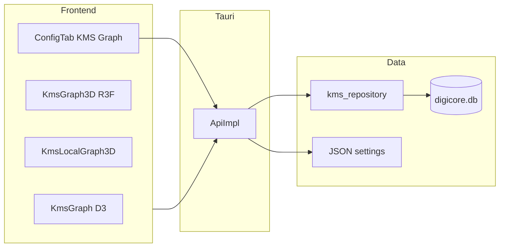

# Knowledge Graph Features: Audit, Findings, and Implementation Plan

> Doc governance status: Legacy/Stale-first (historical baseline)
> Prefer canonical sources: `knowledge-graph-comprehensive-audit-and-roadmap-2026-03.md`, `kms-notebook-capabilities-audit-and-implementation-plan-2026-04.md`
> Governance map: `kms-graph-doc-governance-map-2026-04.md`

**Document purpose:** Standalone audit of DigiCore KMS Knowledge Graph capabilities, gaps versus desired robustness (errors, logging, architecture), alternatives and SWOT, stakeholder decisions, and a phased implementation plan aligned with hexagonal architecture, configuration-first behavior, SOLID, and SRP.

**Related code:** Tauri IPC in `digicore/tauri-app/src-tauri/src/api.rs`, persistence in `kms_repository.rs`, UI in `KmsGraph.tsx`, `KmsGraph3D.tsx`, `KmsLocalGraph3D.tsx`, shared helpers in `digicore/tauri-app/src/lib/kmsGraphHelpers.ts`. Prior vision: `digicore/docs/kms_graph_3.0_roadmap.md`.

---

## 1. Executive Summary

The Knowledge Graph today is a **wiki-link graph** backed by SQLite (`kms_notes`, `kms_links`) plus **optional semantic clustering** (k-means on note text embeddings) and **AI insight beams** (high cosine similarity across different clusters). The main app exposes **global** and **local** (BFS neighborhood) graph payloads over TauRPC. Strengths: local-first, unified DB, working 2D/3D views. Weaknesses: heavy logic in the IPC adapter, hardcoded analytics thresholds (now addressable via **Configurations and Settings**), silent failures on embedding load, O(n^2) beam search, TypeScript/Rust DTO drift, and duplicate edges in the local subgraph BFS.

Phased work: **Phase 0** tightens contracts, deduplicates local edges, and adds diagnostics. **Phase 1** persists graph tuning through the same JSON storage as the rest of the app and exposes a **Knowledge Graph** sub-tab under **Configurations and Settings**. Later phases extract a dedicated graph service, improve scale, and add features (pathfinding, temporal views, previews).

---

## 2. Current Architecture

| Layer | Role | Primary files |
|-------|------|----------------|
| IPC / adapter | Assembles `KmsGraphDto`, clustering, beams, local BFS | `api.rs` (`kms_get_graph`, `kms_get_local_graph`) |
| Repository | SQL, embedding blobs, k-means implementation | `kms_repository.rs` |
| Diagnostics | `log::*` + DB log table | `kms_diagnostic_service.rs` |
| Settings | Key-value JSON via `JsonFileStorageAdapter` | `digicore-text-expander` `ports/storage.rs`, `api.rs` `persist_settings_to_storage` |
| UI graph | Force-directed 2D/3D | `KmsGraph.tsx`, `KmsGraph3D.tsx`, `KmsLocalGraph3D.tsx` |
| UI config | Sub-tab in main app | `ConfigTab.tsx` |

**Link model:** Markdown wiki links are parsed during note indexing (`sync_note_index_internal`, `extract_links_from_markdown`), resolved against the vault, and stored as directed rows in `kms_links` (`upsert_link` with `ON CONFLICT DO NOTHING`).

---

## 3. Detailed Findings

### 3.1 Architecture and SOLID / hexagonal alignment

- **Fat adapter:** Clustering, beam selection, cluster labeling, and subgraph BFS live in `ApiImpl` instead of an application service behind narrow ports (contrast with expander storage ports in `digicore-text-expander`).
- **Repository mixing concerns:** `calculate_kmeans_clusters` is pure analytics but lives beside SQL accessors in `kms_repository.rs` (SRP violation).
- **Duplicated heuristics:** Node type (`note` / `skill` / `image`) and folder path derivation are copy-pasted across `kms_get_graph`, `kms_get_local_graph`, and `kms_get_note_links`.

### 3.2 Configuration and operability

- **Previously hardcoded:** k-means k derived as `sqrt(n)` capped at 10, 15 iterations, beam scan cap 400 nodes, similarity threshold 0.90, max 20 beams. **Phase 1** replaces these with persisted settings (see section 6).
- **Silent degradation:** Embedding load failures were ignored without user-visible diagnostics.

### 3.3 Correctness and consistency

- **Local subgraph duplicate edges:** BFS appended every traversal over an edge, producing duplicate `(source, target)` pairs in the payload.
- **Path alignment for clustering:** `cluster_map` keys come from embedding `entity_id`; node `cluster_id` looks up `n.path` from `kms_notes`. Slash/case mismatches can leave `cluster_id` unset for some nodes.
- **2D layout vs dynamic k:** `KmsGraph.tsx` used a fixed cluster center count; backend k can exceed that. **Phase 0** aligns centers to actual cluster ids present in the filtered node set.

### 3.4 Performance and scale

- **AI beams:** Nested similarity over up to N nodes is O(n^2); acceptable for small vaults only relative to a 10k+ note target.
- **IPC:** Full graph returned on each call; no pagination or incremental refresh.

### 3.5 Types and UX

- **DTO drift:** Rust `KmsGraphDto` included `ai_beams` while TypeScript types omitted it, forcing `as any` in the UI.
- **Errors:** Generic frontend error strings; no structured error codes from the backend.

### 3.6 Relation to `kms_graph_3.0_roadmap.md`

- Metadata and folder paths: largely implemented.
- Local graph: implemented (`kms_get_local_graph` + local 3D view).
- Clustering and labels: partial (k-means + labels + 3D synthetic intra-cluster links).
- **Update (Phase 4–5):** temporal playback, shortest-path highlighting, and RPC hover previews are implemented on **global** 2D/3D and **local** `KmsLocalGraph3D` views. Optional future work: structured IPC error codes, graph pagination, further diagnostic surfacing in UI.

---

## 4. Alternatives (summary)

| Option | Pros | Cons |
|--------|------|------|
| A. Incremental hardening (chosen near term) | Low risk; aligns with existing stack | Technical debt until service extraction |
| B. SQL recursive CTE for local subgraph | Single query; less custom BFS | Path normalization and directed semantics still required |
| C. Materialized graph table | Fast reads | Migrations; invalidation on every index change |
| D. Background worker + cached DTO | Avoids IPC stalls | Invalidation and complexity |
| E. ANN / sqlite-vec for beams | Scales similarity edges | Extra dependency and tuning |
| F. Client-only layout | Thinner server | Server still needed for clustering if retained |

---

## 5. SWOT

| | **Helpful** | **Harmful** |
|---|-------------|-------------|
| **Internal (S/W)** | **S:** Local-first, single DB, real wiki links, embeddings, rich 2D/3D UI. **W:** Monolithic handler (being reduced), former silent failures (addressed in Phase 0), O(n^2) beams, type drift (addressed in Phase 0). | |
| **External (O/T)** | **O:** sqlite-vec, `petgraph`, background indexing, stronger ANN. **T:** Large vaults + synchronous IPC if analytics stay unbounded. | |

---

## 6. Phase 1: Configuration-first (GUI + persisted settings)

**Storage decision:** Graph tuning lives in the **same JSON key-value store** as all other DigiCore settings (`JsonFileStorageAdapter`), not a separate `kms_graph.json` under the vault. **Per-vault overrides** are stored in `kms_graph_vault_overrides_json` (map keyed by vault path; JSON editor in Vault Settings) and merged in `kms_get_graph` / `effective_graph_build_params`; settings bundles include `kms_graph_vault_overrides` under group `kms_graph` (bundle `schema_version` 1.1.0 for new exports).

**Keys** (flat, snake_case; mirrored on `AppState` and `ConfigUpdateDto`):

| Key | Type | Default (matches legacy behavior) |
|-----|------|-----------------------------------|
| `kms_graph_k_means_max_k` | u32 | 10 (cap on `sqrt(n)` k) |
| `kms_graph_k_means_iterations` | u32 | 15 |
| `kms_graph_ai_beam_max_nodes` | u32 | 400 |
| `kms_graph_ai_beam_similarity_threshold` | f32 | 0.90 |
| `kms_graph_ai_beam_max_edges` | u32 | 20 |
| `kms_graph_enable_ai_beams` | bool | true |
| `kms_graph_enable_semantic_clustering` | bool | true |

**Frontend:** **Configurations and Settings** in the main app (`ConfigTab.tsx`): new sub-tab **Knowledge Graph** (`id: kms_graph`) in `SETTINGS_GROUP_OPTIONS`, state hydrated from `get_app_state`, **Save** via `update_config` + `save_settings` + `get_app_state` (same as other groups).

**Backend:** Fields on `AppState` in `digicore-text-expander`, `AppStateDto` / `ConfigUpdateDto` / `app_state_to_dto` in `lib.rs`, `update_config` and `persist_settings_to_storage` / `init_app_state_from_storage` in `api.rs` / `lib.rs`, storage constants in `ports/storage.rs`.

**Settings bundles:** Group `kms_graph` added to export/import so graph settings can travel with other bundles.

**Runtime:** `kms_get_graph` reads locked `AppState` for the above values. If semantic clustering is disabled, skip embedding-driven clustering and beams. If beams are disabled, skip the O(n^2) beam loop only.

---

## 7. Implementation status (this delivery)

| Phase | Items | Status |
|-------|--------|--------|
| **0** | `KmsAiBeamDto` / `ai_beams` in `bindings.ts`; remove `(data as any)`; dedupe local graph edges; diagnostics on embedding failure, empty/timing logs; dynamic cluster count in `KmsGraph.tsx` | Implemented |
| **1** | App settings keys, Config tab, `update_config`, persist/load, bundle group, `kms_get_graph` uses config | Implemented |
| **2** | Extract `kms_graph_service`, move k-means out of repository | Implemented (`kms_graph_service.rs`; `api.rs` delegates clustering, beams, labels, local BFS) |
| **3** | ANN / spawn_blocking / caps and UI warnings | Implemented: `spawn_blocking` full-graph build; semantic note cap + large-vault warning + beam pair budget; `KmsGraphDto.warnings`; Config tab + persistence |
| **4** | Pathfinding, temporal playback, preview RPC | Implemented: `kms_get_graph_shortest_path`, `kms_get_note_graph_preview` in `api.rs`; BFS in `kms_graph_service.rs`; `KmsGraph.tsx` path finder, green path highlight, hover preview, timeline Play; **3D parity** in `KmsGraph3D.tsx` (same RPCs, link/node highlight, debounced RPC preview on hover, timeline Play); shared pure helpers in `src/lib/kmsGraphHelpers.ts` + `kmsGraphHelpers.test.ts` (Vitest) |
| **5** | Local subgraph UX parity | Implemented: `KmsLocalGraph3D.tsx` uses typed `kms_get_local_graph`; same shortest-path + preview RPCs as global graphs; temporal slider + Play; path/link/node highlight; **partial-path notice** when the wiki path leaves the BFS neighborhood (`linkKeysFromGraphLinks`, `visiblePathEdgeCount` in `kmsGraphHelpers.ts`) |
| **6** | Per-vault graph overrides | Implemented: `kms_graph_vault_overrides_json`, Vault Settings modal, merge at graph build; optional auto-paging + session paging controls in 2D/3D graph UIs |

---

## 8. Diagnostic and logging standards

- Use `KmsDiagnosticService` for KMS-user-visible diagnostics (persisted + `log`).
- On embedding load **failure**, log **warn** with error detail (not silent).
- On successful graph build, **debug** may include timing (ms) and counts (notes, edges, clusters, beams).
- Prefer structured messages: `[KMS][Graph]` prefix for grep-friendly logs.

---

## 9. Decision log (stakeholder input)

1. **Target scale:** Define soft cap for full graph vs simplified mode (e.g. >2k notes) when implementing Phase 3.
2. **Semantic defaults:** Defaults keep clustering and beams **on** to match legacy behavior; product may later ship off-by-default for battery-sensitive installs.
3. **Hexagonal strictness:** Phase 2 can stay inside `src-tauri` or introduce a small shared crate; needs product call.
4. **Directed vs undirected semantics:** Wiki links are stored directed; local BFS treats adjacency as undirected for neighborhood discovery document the choice before pathfinding UI.
5. **Config location:** Phase 1 uses **global app config**; per-vault overrides are **implemented** as optional JSON per vault path (see section 6 and Phase 6 table row).
6. **Roadmap priority:** Choose among pathfinding, temporal slider data, embedding model upgrades, 3D polish.

---

## 10. Scope note

Untracked `digicore/kms-test-vault/**` trees in some workspaces are **test fixtures**, not part of the shipping product unless explicitly adopted.

---

## 11. References

- `digicore/tauri-app/src-tauri/src/api.rs` -- `kms_get_graph`, `kms_get_local_graph`, settings persistence
- `digicore/tauri-app/src-tauri/src/kms_repository.rs` -- links, embeddings, k-means
- `digicore/tauri-app/src/components/ConfigTab.tsx` -- Configurations and Settings
- `digicore/docs/digicore-notes/knowledge_management_suite.md` -- KMS overview
- `digicore/docs/kms_graph_3.0_roadmap.md` -- vision doc
