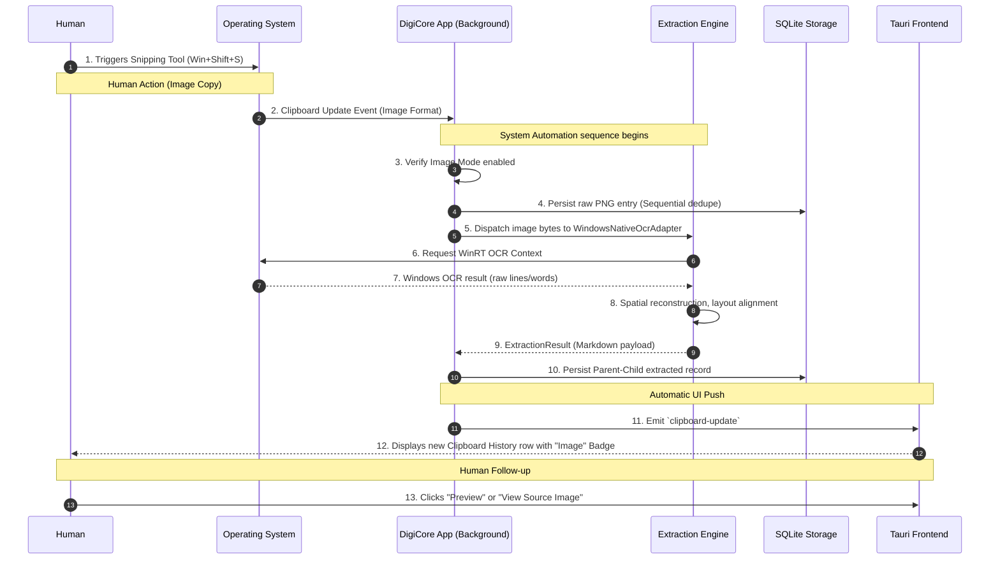
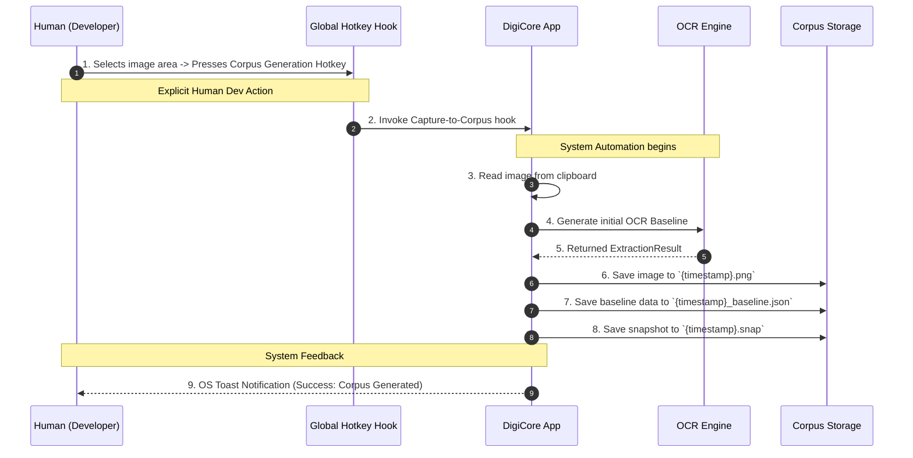

# Text Expander Use Cases (Phases 12-55)

The DigiCore Text Expander integrates seamless human interactions with powerful background system automation. By separating these roles, the application provides a zero-friction experience for immediate use, while empowering complex diagnostics and heuristics tuning for advanced users.

## 1. Capturing and Extracting Text from an Image

**Goal:** Allow users to effortlessly extract text from screenshots or images on their clipboard, directly feeding into their snippet history.



### Human vs. System Interaction
- **Human Role:** Initiates the capture by pressing standard OS hotkeys (Win+Shift+S) to copy an image to the clipboard. The user later views the automatically generated Markdown in the Tauri GUI or right-clicks "View Source Image".
- **System Role:** The background clipboard listener (`windows_clipboard_listener.rs`) detects the image. The system validates the content, triggers the Hexagonal adapter (`WindowsNativeOcrAdapter`), processes the complex geometry/spatial arrangement of the text invisibly, and saves both the image and the extraction to SQLite without prompting the user.

---

## 2. Generating a Corpus Baseline Snapshot (Golden Master)

**Goal:** Quickly capture complex image layouts and generate a "baseline snapshot" to evaluate OCR extraction engines during regression testing.



### Human vs. System Interaction
- **Human Role:** A developer highlights a visually complex screen region via the snipping tool and immediately taps a configurable global keyboard hotkey specifically bound to "Corpus Generation".
- **System Role:** Intercepts the hotkey, circumvents the standard `clipboard_history` flow, invokes `corpus_generator.rs`, extracts the text using the current "best effort" heuristic config, and automatically seeds the `corpus/` testing folder with the image, JSON metadata, and an `.snap` baseline file for `insta` to use in the regression suite.

---

## 3. Tuning the Extraction Heuristics via GUI

**Goal:** Modify the behavior of the Extensible OCR Engine (such as adjusting gap gates, row alignment densities, or semantic tagging rules) via a configuration-first GUI without altering code or interacting directly with a YAML/JSON configuration file.

```mermaid
flowchart TD
    classDef humanLayer fill:#bbdefb,stroke:#01579b,stroke-width:2px;
    classDef systemLayer fill:#e1bee7,stroke:#8e24aa,stroke-width:2px;

    User([User]):::humanLayer -->|Inputs numeric multiplier defaults| Form[Tauri ConfigTab.tsx UI]:::humanLayer
    
    Form -->|Triggers| SaveBtn([Clicks Save All Settings]):::humanLayer
    
    SaveBtn -->|update_config IPC call| Api[api.rs backend]:::systemLayer
    
    Api -->|Validates ConfigUpdateDto| Validate[Type Validation]:::systemLayer
    Validate -->|Munges JSON block| Store[JsonFileStorageAdapter (Disk Write)]:::systemLayer
    
    Store -->|Emits Notification| Notify[OS / Toast Notification UI]:::systemLayer
    
    Notify -->|Success feedback visible| User
    
    %% Next extraction
    Trigger([Next Clipboard Event]):::humanLayer --> Engine[OCR Baseline Extraction]:::systemLayer
    Engine -. "Polls New Heuristics" .-> Store
```

### Human vs. System Interaction
- **Human Role:** Interacts visually with the text inputs, sliders, and checkboxes in the "Configurations and Settings" tab of the Tauri app. The human saves changes knowing the settings take immediate effect.
- **System Role:** The Tauri `update_config` middleware accepts the command payload, unpacks it gracefully applying `Default::default()` bounds, delegates the specific storage logic to the `JsonFileStorageAdapter` port, overwrites the JSON file, and provides OS-level visual feedback indicating success. Any subsequent OCR tasks pull these dynamic numbers from memory without needing a restart.
